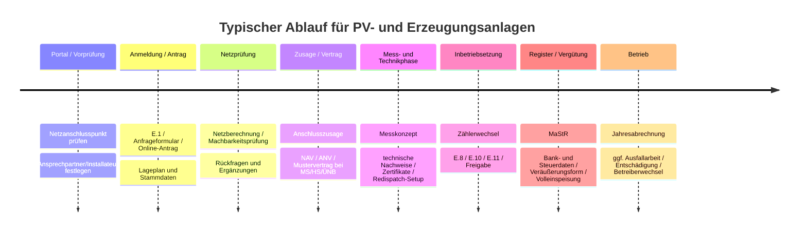

# Katalog offizieller PDF-Formulare für PV, Erzeugungsanlagen, Netzanschluss, Einspeisung und Redispatch in Deutschland

## Kurzfassung

Für die priorisierten deutschen Netzbetreiber und Behörden zeigt sich ein klares Muster: Bei kleinen PV-Anlagen und steckerfertigen Anlagen verlagern die Verteilnetzbetreiber den Erstprozess zunehmend in Portale; bei Mittel- und Hochspannung bleiben klassische PDF-Formulare weiterhin zentral. Besonders formularstark und öffentlich zugänglich sind Westnetz, Netze BW, N‑ERGIE Netz, SWM Infrastruktur, Amprion, 50Hertz und TransnetBW. Bayernwerk stellt wichtige PDFs bereit, verweist für Standardfälle aber ebenfalls stark auf sein Netzanschluss-Portal. Bei den Übertragungsnetzbetreibern ist seit 2026 das gemeinsame Reifegradverfahren prägend; dort sind F.2 bis F.5 als PDF verfügbar, F.1 und teils F.6 dagegen als XLSX bzw. nicht als PDF. Marktstammdatenregister und steuerliche Erfassung laufen heute überwiegend online; gleichwohl existieren offizielle PDF-Hilfen und einzelne behördliche PDF-Formulare, insbesondere in Bayern und NRW.

Für ein Open-Source-Projekt zur Formularunterstützung ist der belastbarste Einstieg daher nicht „alle Formulare vollständig ersetzen“, sondern: öffentliche PDF-Vorlagen katalogisieren, Datenfelder strukturieren, Portal-Only-Stellen deutlich markieren und nur dort Automatisierung anbieten, wo die Primärquelle stabil und öffentlich ist. Rechtlich wichtig: In den geprüften Quellen war regelmäßig **keine offene Nachnutzungslizenz** ausgewiesen; Netze BW nennt ausdrücklich „Alle Rechte vorbehalten“, N‑ERGIE Netz ebenfalls, SWM weist Copyright aus. Für ein öffentliches OSS-Projekt sollten die PDFs deshalb eher **verlinkt und beschrieben** als selbst neu verteilt werden.

## Priorisierte Suchreihenfolge

Die folgende Reihenfolge ist für Praxis, Umfang und Aktualität am sinnvollsten. Sie priorisiert Betreiber mit hoher Marktbedeutung, öffentlichem Formularbestand und Relevanz für PV-/Erzeugungsanlagenprozesse.

| Priorität | Stelle | Warum zuerst prüfen | Typischer Zugang | Status im Katalog |
|---|---|---|---|---|
| Sehr hoch | Bayernwerk | großer bayerischer VNB; Portal plus PDF-Bestand für Vergütung, Speicher und MS/HS | Portal + PDFs | gut erschlossen |
| Sehr hoch | Westnetz | viele öffentliche VDE-/TAB-Formulare plus Abrechnungsformulare | PDFs + Portal | sehr gut erschlossen |
| Sehr hoch | Netze BW | eigene Anfrageformulare ab 135 kW, Anlagenänderungen, Messkonzepte, Portal für <135 kW | PDFs + Kundenportal | sehr gut erschlossen |
| Sehr hoch | N‑ERGIE Netz | öffentliche Formularseite mit E.2/E.3/E.8, Einspeiseart, Veräußerungsform, Steckersolar | PDFs + Online-Service | sehr gut erschlossen |
| Sehr hoch | SWM Infrastruktur | breite Formularsammlung inkl. Einspeisemanagement, Inbetriebsetzung, Steuer-/Vergütungsformulare | PDFs + Portale | sehr gut erschlossen |
| Hoch | 50Hertz | öffentliche Reifegrad- und Netzanschlussdokumente; gemeinsame 4‑ÜNB-Formulare | PDFs + XLSX + HTML | gut erschlossen |
| Hoch | Amprion | durchgängige Onshore‑EE-Prozessstrecke mit Checkliste, NDA, Zeitplan und Vertragsmustern | PDFs + HTML | sehr gut erschlossen |
| Hoch | TransnetBW | öffentliche Reifegrad-PDFs, BESS-Mustervertrag, TAB HöS | PDFs + XLSX + HTML | sehr gut erschlossen |
| Hoch | TenneT | öffentlicher PDF-Bestand deutlich dünner; relevante Dokumente über netztransparenz.tennet.eu | PDFs + gemeinsame 4‑ÜNB-Doku | nur teilweise erschlossen |
| Hoch | Bundesnetzagentur / MaStR | Registrierung und Ausschreibungen; viele Hilfs-PDFs und formale Anträge | PDFs + Online-Register | gut erschlossen |
| Mittel | BDEW | keine klassischen Anschlussanträge, aber zentrale Redispatch-/Ausfallarbeitsdokumente | PDFs + Fachseiten | gut erschlossen |
| Mittel | Landesämter/Finanzverwaltungen | heute meist ELSTER-first; Bayern und NRW mit PV-spezifischen PDFs | PDFs + ELSTER | teilweise erschlossen |

## Katalog Anmeldung und Inbetriebsetzung

**Anmeldung / Antrag**

**Bayernwerk – Antragsstellung für Ihren Speicher**  
Datei: `bage_antragstellung_speicher.pdf`  
Direktlink: `https://www.bayernwerk-netz.de/content/dam/revu-global/bayernwerk-netz/files/Energieeinspeisen/energiespeicher/bage_antragstellung_speicher.pdf`  
Zweck: Antrag für Stand‑Alone- und Co‑Location-Speicher. Typische Felder: Speicherverhalten, Anlagentyp, Netzbezug/Netzlieferung, Anschlusssituation, ggf. Eigenverbrauch/Volleinspeisung. Stand: 2026. Wiederverwendung: keine offene Lizenz ersichtlich.

**Bayernwerk – E.1 Antragstellung Netzanschluss Mittelspannung**  
Datei: `20210412-bayernwerk-e01-antragstellung-netzanschluss-mittelspannung.pdf`  
Direktlink: `https://www.bayernwerk-netz.de/content/dam/revu-global/bayernwerk-netz/files/netz/netzanschluss/Strom/technische_Mindestanforderungen_ab01112018/Formulare/20210412-bayernwerk-e01-antragstellung-netzanschluss-mittelspannung.pdf`  
Zweck: formale Netzanschlussanfrage MS. Typische Felder: Bauvorhaben, Anlagenanschrift, PAV,B / PAV,E, Leistung, Messstellenbetrieb, beigefügte Unterlagen wie E.8. Stand: 2021. Wiederverwendung: keine offene Lizenz ersichtlich.

**Westnetz – E.1 Antragstellung Niederspannung**  
Datei: `e1-antragstellung-fuer-erzeugungsanlagen-am-niederspannungsnetz.pdf`  
Direktlink: `https://www.westnetz.de/content/dam/revu-global/westnetz/documents/bauen/ihr-weg-zum-netzanschluss/niederspannung/e1-antragstellung-fuer-erzeugungsanlagen-am-niederspannungsnetz.pdf`  
Zweck: Anmeldung von Erzeugungsanlagen am NS-Netz. Typische Felder: Anlagenanschrift, Anschlussnehmer, Anlagenbetreiber, Elektrofachbetrieb, Lageplan, Anlagenart, Inbetriebsetzungstermin. Stand: im Web seit rund 2020. Wiederverwendung: keine offene Lizenz ersichtlich.

**Westnetz – E.1 Antragstellung Mittelspannung**  
Datei: `e1-antrag-netzanschluss-mittelspannung.pdf`  
Direktlink: `https://www.westnetz.de/content/dam/revu-global/westnetz/documents/bauen/ihr-weg-zum-netzanschluss/mittelspannung/e1-antrag-netzanschluss-mittelspannung.pdf`  
Zweck: Netzanschlussantrag MS. Typische Felder: Bauvorhaben, Gemarkung/Flurstück, Leistung, Netzanschlussplanung, Anlagenart. Stand: öffentlich verfügbar; Westnetz-TAB 2025 verweist zusätzlich auf Portalnutzung. Wiederverwendung: keine offene Lizenz ersichtlich.

**Netze BW – Anfrageformular PV-Anlage ab 135 kW**  
Datei: `anfrageformular-photovoltaikanlage-ab-135-kw.pdf`  
Direktlink: `https://assets.cdn.netze-bw.de/xytfb1vrn7of/7fLUmwxob6TZsKg5tTjvT9/0d7eb1e0b1e71933a7477d8cde04b4f1/anfrageformular-photovoltaikanlage-ab-135-kw.pdf`  
Zweck: Anfrage zum Anschluss einer PV‑Erzeugungsanlage ab 135 kW und zugleich Auftrag zur Netzberechnung. Typische Felder: Betreiber, Standort, Modulleistung, SA,E / PA,E, Speicher, Messkonzept, Veräußerungsform, Volleinspeisungs-Bonus, Vollmacht Zählertausch. Stand: 06/2025. Wiederverwendung: keine offene Lizenz ersichtlich.

**Netze BW – Anfrageformular EEG-Erzeugungsanlagen nicht PV ab 135 kW**  
Datei: `anfrageformular-eeg-erzeugungsanlagen-nicht-pv-ab-135-kw.pdf`  
Direktlink: `https://assets.cdn.netze-bw.de/xytfb1vrn7of/7D7CGguIrdRcPqmxP4RJcC/80e42ee28b58d91efb2382596d5c3da5/anfrageformular-eeg-erzeugungsanlagen-nicht-pv-ab-135-kw.pdf`  
Zweck: Anschlussanfrage nicht-solarer EEG-Anlagen ab 135 kW. Typische Felder: Betreiber, Standort, Energieart, Leistung, Netzberechnung, Vermarktungsangaben. Stand: 06/2025 laut Formularseite. Wiederverwendung: keine offene Lizenz ersichtlich.

**N‑ERGIE Netz – E.2 Datenblatt Erzeugungsanlage**  
Datei: `N_E2_Datenblatt_Erzeugungsanlage.pdf`  
Direktlink: `https://www.n-ergie-netz.de/public/remotemedien/media/nng/produkte_und_dienstleistungen_2/erzeugungsanlagen_2/formulare_1/N_E2_Datenblatt_Erzeugungsanlage.pdf`  
Zweck: Stammdatenblatt NS-Erzeugungsanlagen. Typische Felder: Anlagenanschrift, Energieart, Erzeugungseinheiten, PAmax/SAmax, Einspeiseart, Inselbetrieb, Volleinspeisung/Überschusseinspeisung. Stand: Januar 2020. Wiederverwendung: keine offene Lizenz ersichtlich.

**SWM Infrastruktur – Datenblatt Erzeugungsanlagen am Niederspannungsnetz**  
Datei: `datenerfassung-erzeugungsanlagen.pdf`  
Direktlink: `https://www.swm-infrastruktur.de/dam/swm-infrastruktur/dokumente/strom/netzanschluss/erzeugungsanlagen/datenerfassung-erzeugungsanlagen.pdf`  
Zweck: Datenerfassung/Anmeldung NS-Erzeugungsanlagen. Typische Felder: Betreiber, Standort, Anlagentyp, Leistung, technische Daten. Stand: öffentlich auf SWM‑Formularseite. Wiederverwendung: keine offene Lizenz ersichtlich.

**Amprion – Checkliste für ein qualifiziertes Anschlussbegehren**  
Datei: `Checkliste_V2-2_Netzanschlussanfrage_Erzeugungsanlagen_DE.pdf`  
Direktlink: `https://www.amprion.net/Dokumente/Strommarkt/Netzkunden/Netzanschlussregeln/02_Onshore-EE-Anlagen/Checkliste_V2-2_Netzanschlussanfrage_Erzeugungsanlagen_DE.pdf`  
Zweck: Pflichtunterlagenliste für Onshore‑EE-Anschlussbegehren >100 MW bzw. ÜNB-Ebene. Typische Inhalte/Felder: Nachweisunterlagen, Projektinformationen, technische und genehmigungsrelevante Anlagen. Stand: 2025-Kontext der Onshore‑EE-Verfahrensseite. Wiederverwendung: keine offene Lizenz ersichtlich.

**TenneT – KraftNAV Unterlagenliste**  
Datei: `Unterlagenliste_Stand_2022-06-15.pdf`  
Direktlink: `https://netztransparenz.tennet.eu/fileadmin/user_upload/The_Electricity_Market/German_Market/Grid_customers/Network_connection_customers/KraftNAV/Unterlagenliste_Stand_2022-06-15.pdf`  
Zweck: TenneT-Unterlagenliste für KraftNAV‑Anschlussbegehren. Typische Inhalte: einzureichende Planungs‑ und Projektdokumente, Fristen, Anschlussprozessdokumente. Stand: 15.06.2022. Wiederverwendung: keine offene Lizenz ersichtlich.

**Inbetriebsetzung / Zähler / Messkonzept**

**Bayernwerk – E.5 Inbetriebsetzungsauftrag**  
Datei: `20210412-bayernwerk-e05-inbetriebsetzungsauftrag.pdf`  
Direktlink: `https://www.bayernwerk-netz.de/content/dam/revu-global/bayernwerk-netz/files/netz/netzanschluss/Strom/technische_Mindestanforderungen_ab01112018/Formulare/20210412-bayernwerk-e05-inbetriebsetzungsauftrag.pdf`  
Zweck: Auftrag zur Inbetriebsetzung von Kunden-/Erzeugungsanlagen. Typische Felder: Projektbezeichnung, Leistungswerte, Direktvermarktung/Bilanzkreiszuordnung, Mess- und Betriebsangaben. Stand: 2021. Wiederverwendung: keine offene Lizenz ersichtlich.

**Bayernwerk – E.10 Inbetriebsetzungsprotokoll für Erzeugungseinheiten**  
Datei: `bayernwerk-e10-inbetriebsetzungsprotokoll-erzeugungseinheiten.pdf`  
Direktlink: `https://www.bayernwerk-netz.de/content/dam/revu-global/bayernwerk-netz/files/netz/netzanschluss/Strom/technische_Mindestanforderungen_ab01112018/Formulare/bayernwerk-e10-inbetriebsetzungsprotokoll-erzeugungseinheiten.pdf`  
Zweck: Inbetriebsetzungsprotokoll je Einheit/Speicher. Typische Felder: Anschrift der EZE, Zertifikats-/Planungsverantwortliche, technische Bestätigung, Datum/Unterschriften. Stand: 11/2023. Wiederverwendung: keine offene Lizenz ersichtlich.

**Bayernwerk – E.11 Inbetriebsetzungserklärung Erzeugungsanlagen**  
Datei: `e11-inbetriebsetzungserklaerung-erzeugungsanlagen.pdf`  
Direktlink: `https://www.bayernwerk-netz.de/content/dam/revu-global/bayernwerk-netz/files/energieerzeugen/mittelspannunghochspannung/e11-inbetriebsetzungserklaerung-erzeugungsanlagen.pdf`  
Zweck: Abschluss-/Freigabeerklärung für EZA/Speicher. Typische Felder: tatsächliche Betriebsmittel, Seriennummern, Abweichungen zum Anlagenzertifikat, Prüfprotokolle, Regler-/Schutzeinstellungen. Stand: 09/2022. Wiederverwendung: keine offene Lizenz ersichtlich.

**Westnetz – E.8 Inbetriebsetzungsprotokoll Niederspannung**  
Datei: `e8-inbetriebsetzungsprotokoll-erzeugungsanlagen-speicher-niederspannung.pdf`  
Direktlink: `https://www.westnetz.de/content/dam/revu-global/westnetz/documents/bauen/ihr-weg-zum-netzanschluss/niederspannung/e8-inbetriebsetzungsprotokoll-erzeugungsanlagen-speicher-niederspannung.pdf`  
Zweck: Inbetriebsetzungsprotokoll für NS-Erzeugungsanlagen/Speicher. Typische Felder: Übereinstimmung E.2/E.3, Messprüfung, Zertifikate, NA‑Schutz, PAV,E‑Überwachung, Symmetrie, Blindleistung. Stand: öffentlich seit rund 2020. Wiederverwendung: keine offene Lizenz ersichtlich.

**Westnetz – E.11 Inbetriebsetzungserklärung Erzeugungsanlage/Speicher**  
Datei: `e11-inbetriebsetzungserklaerung-erzeugungsanlage-speicher.pdf`  
Direktlink: `https://www.westnetz.de/content/dam/revu-global/westnetz/documents/bauen/ihr-weg-zum-netzanschluss/mittelspannung/e11-inbetriebsetzungserklaerung-erzeugungsanlage-speicher.pdf`  
Zweck: Inbetriebsetzungserklärung MS für EZA/Speicher. Typische Felder: Projektbezeichnung, vereinbarte Wirk-/Scheinleistung, Erklärender, Anlagenbetreiber, technische Konformität. Stand: öffentlich seit rund 2020. Wiederverwendung: keine offene Lizenz ersichtlich.

**Netze BW – Inbetriebnahme/Inbetriebsetzung Niederspannung**  
Datei: `inbetriebnahme-inbetriebsetzung-niederspannung.pdf`  
Direktlink: `https://assets.cdn.netze-bw.de/xytfb1vrn7of/4axOO16AiAqqQGaCYyoCU2/8f438d1ebe474df0f03e2762340422ca/inbetriebnahme-inbetriebsetzung-niederspannung.pdf`  
Zweck: Standardformular für Einbau/Wechsel der Messeinrichtung und Inbetriebsetzung, auch bei Erzeugungsanlagen. Typische Felder: Art der Anlage, Messgerätetyp, Terminwunsch, Anschlussnutzer, Erklärung Elektrofachbetrieb. Stand: öffentlich; Formularseite 2026. Wiederverwendung: keine offene Lizenz ersichtlich.

**Netze BW – E.10 Inbetriebsetzungsprotokoll EZA/Speicher**  
Datei: `E10_Inbetriebsetzungsprotokoll_EZA_Speicher_V1_3_mit_Passwort.pdf`  
Direktlink: `https://assets.cdn.netze-bw.de/xytfb1vrn7of/3wHIQnF9DaQ0XrqQPGkass/6a53c2f6a6069385f91cc775b6345653/E10_Inbetriebsetzungsprotokoll_EZA_Speicher_V1_3_mit_Passwort.pdf`  
Zweck: Inbetriebsetzungsprotokoll MS. Typische Felder: technische Schlussprüfung je Erzeugungseinheit/Speicher. Stand: Formularseite 2025/2026. Wiederverwendung: keine offene Lizenz ersichtlich.

**Netze BW – Meldeformular Änderung des Messkonzepts**  
Datei: `aenderung-des-messkonzepts.pdf`  
Direktlink: `https://assets.cdn.netze-bw.de/xytfb1vrn7of/6u1US6tNGoOQSqca0amq2o/f1490333aea2c54f38cb27a5c097e45d/aenderung-des-messkonzepts.pdf`  
Zweck: nachträgliche Meldung eines geänderten Messkonzepts. Typische Felder: Bestandsanlage, neues Messkonzept, Standort, Betreiber, technische Änderung. Stand: auf Seite „Technische Änderungen melden“ veröffentlicht. Wiederverwendung: keine offene Lizenz ersichtlich.

**N‑ERGIE Netz – E.8 Inbetriebsetzungsprotokoll**  
Datei: `N_E8_Inbetriebsetzungsprotokoll_Erzeugungsanlage_Speicher.pdf`  
Direktlink: `https://www.n-ergie-netz.de/public/remotemedien/media/nng/produkte_und_dienstleistungen_2/erzeugungsanlagen_2/formulare_1/N_E8_Inbetriebsetzungsprotokoll_Erzeugungsanlage_Speicher.pdf`  
Zweck: Inbetriebsetzungsprotokoll NS-Erzeugungsanlagen/Speicher. Typische Felder: SAmax/PAmax, Modulleistung, E.2/E.3‑Konsistenz, Zertifikate, NA‑Schutz, Regelung, Drosselung, Zählerstand. Stand: Januar 2020. Wiederverwendung: keine offene Lizenz ersichtlich.

**SWM Infrastruktur – Inbetriebsetzungsprotokoll Erzeugungsanlage**  
Datei: `inbetriebsetzungsprotokoll-erzeugungsanlage.pdf`  
Direktlink: `https://www.swm-infrastruktur.de/dam/swm-infrastruktur/dokumente/strom/netzanschluss/erzeugungsanlagen/inbetriebsetzungsprotokoll-erzeugungsanlage.pdf`  
Zweck: Inbetriebsetzungsprotokoll für NS-EZA. Typische Felder: Anlagen- und Errichterdaten, technische Checkboxen, Inbetriebsetzungsdatum. Stand: auf Formularseite 2026. Wiederverwendung: keine offene Lizenz ersichtlich.

**SWM Infrastruktur – Inbetriebsetzungsprotokoll Erzeugungseinheiten Mittelspannung**  
Datei: `e-10_inbetriebsetzungsprotokoll-erzeugungseinheiten-ms.pdf`  
Direktlink: `https://www.swm-infrastruktur.de/dam/swm-infrastruktur/dokumente/strom/netzanschluss/erzeugungsanlagen/e-10_inbetriebsetzungsprotokoll-erzeugungseinheiten-ms.pdf`  
Zweck: E.10-artiges MS‑Inbetriebsetzungsprotokoll. Typische Felder: EZE-/Speicherdaten, Regler-/Schutznachweise, Konformität. Stand: Formularseite 2026. Wiederverwendung: keine offene Lizenz ersichtlich.

**Messkonzepte als ergänzende Pflichtunterlagen**  
Bayernwerk veröffentlicht die aktuellen VBEW-Messkonzepte und Verdrahtungsschemen; N‑ERGIE veröffentlicht Messkonzepte für EEG-/KWKG-Anlagen; Netze BW verlangt Messkonzeptangaben bereits im Anfrageformular ab 135 kW. Diese Dokumente sind keine „Anträge“, aber regelmäßig entscheidend für Zählerkonzept, Abrechnung und Förderlogik.

## Katalog Vergütung, Steuer und Betreiberänderungen

**Vergütung / Einspeiseabrechnung / Betreiberwechsel**

**Bayernwerk – Vergütungsanmeldung Stecker-PV**  
Datei: `bayernwerk-verguetungsanmeldung-stecker-pv.pdf`  
Direktlink: `https://www.bayernwerk-netz.de/content/dam/revu-global/bayernwerk-netz/files/Energieeinspeisen/Ihre-Anlage/bayernwerk-verguetungsanmeldung-stecker-pv.pdf`  
Zweck: Antrag auf EEG-Vergütung für Steckersolargeräte. Typische Felder: Betreiber, Anlagenstandort, MaStR-Nr., Modulleistung, Zählerdaten, Steuernummer, Bankverbindung. Stand: 2024/2025-Kontext; veröffentlichte Webseite nennt den Start der Vergütung ab übernächstem Monat. Wiederverwendung: keine offene Lizenz ersichtlich.

**Bayernwerk – Mitteilung erhöhter anzulegender Wert bei Volleinspeiser-Solaranlage**  
Datei: `bayernwerk-inanspruchnahme-erhöhter-anzulegender-wert-volleinspeiser-solaranlage.pdf`  
Direktlink: `https://www.bayernwerk-netz.de/content/dam/revu-global/bayernwerk-netz/files/Energieeinspeisen/Ihre-Anlage/bayernwerk-inanspruchnahme-erh%C3%B6hter-anzulegender-wert-volleinspeiser-solaranlage.pdf`  
Zweck: Erklärung für Volleinspeiser-Bonus. Typische Felder: Betreiberdaten, Kalenderjahr, Volleinspeisebestätigung, Unterschrift. Stand: ab 2023/2024 relevant. Wiederverwendung: keine offene Lizenz ersichtlich.

**Westnetz – Änderung Ihrer Bankverbindung**  
Datei: `aenderung-der-bankverbindung.pdf`  
Direktlink: `https://www.westnetz.de/content/dam/revu-global/westnetz/documents/einspeisen/die-abrechnung/aenderung-der-bankverbindung.pdf`  
Zweck: Änderung der Auszahlungsbankverbindung für Einspeiser. Typische Felder: Anlagenbetreiber, Standort, Vertragskontonummer/EP-ID, alte/neue Bankdaten. Wiederverwendung: keine offene Lizenz ersichtlich.

**Westnetz – Bekanntgabe eines Betreiberwechsels**  
Datei: `bekanntgabe-eines-betreiberwechsels.pdf`  
Direktlink: `https://www.westnetz.de/content/dam/revu-global/westnetz/documents/einspeisen/die-abrechnung/bekanntgabe-eines-betreiberwechsels.pdf`  
Zweck: Umschreibung der Anlage auf neuen Betreiber. Typische Felder: bisheriger und neuer Betreiber, MaStR-Nummern, Steueroption, Steuernummer, gewünschte Schlussrechnung. Wiederverwendung: keine offene Lizenz ersichtlich.

**Westnetz – Änderung Steuernummer/Besteuerungsform**  
Datei: `aenderung-steuernummer-besteuerungsform.pdf`  
Direktlink: `https://www.westnetz.de/content/dam/revu-global/westnetz/documents/einspeisen/die-abrechnung/aenderung-steuernummer-besteuerungsform.pdf`  
Zweck: steuerliche Stammdatenänderung. Typische Felder: Betreiber, Standort, Vertragskontonummer, neue Steuernummer, Wahl Kleinunternehmer/Regelbesteuerung. Wiederverwendung: keine offene Lizenz ersichtlich.

**Westnetz – Antwortformular zur Stromsteuerbefreiung**  
Datei: `formular-steuerbefreiung.pdf`  
Direktlink: `https://www.westnetz.de/content/dam/revu-global/westnetz/documents/einspeisen/die-abrechnung/formular-steuerbefreiung.pdf`  
Zweck: Antwortformular zur Stromsteuerbefreiung im Einspeisekontext. Typische Felder: Angaben des Anlagenbetreibers, Unterschrift aller Betreiber. Wiederverwendung: keine offene Lizenz ersichtlich.

**N‑ERGIE Netz – Formulare für die Veränderung der Einspeiseart**  
Datei: `N_Formulare_fuer_die_Aenderung_der_Einspeiseart.pdf`  
Direktlink: `https://www.n-ergie-netz.de/public/remotemedien/media/nng/produkte_und_dienstleistungen_2/erzeugungsanlagen_2/formulare_1/N_Formulare_fuer_die_Aenderung_der_Einspeiseart.pdf`  
Zweck: Änderung zwischen Überschuss-/Volleinspeisung bzw. vergleichbaren Einspeisearten. Typische Felder: Anlagendaten, bisherige/neue Einspeiseart, Datum, Betreiberzustimmung. Wiederverwendung: keine offene Lizenz ersichtlich.

**N‑ERGIE Netz – Angaben zur Veräußerungsform**  
Datei: `N_Angaben_zur_Veraeusserungsform.pdf`  
Direktlink: `https://www.n-ergie-netz.de/public/remotemedien/media/nng/produkte_und_dienstleistungen_2/erzeugungsanlagen_2/formulare_1/N_Angaben_zur_Veraeusserungsform.pdf`  
Zweck: Mitteilung Einspeisevergütung / Marktprämie / Direktvermarktung. Typische Felder: Anlage, Vermarktungsform, Beginn, Betreiber. Wiederverwendung: keine offene Lizenz ersichtlich.

**N‑ERGIE Netz – Inanspruchnahme einer Einspeisevergütung für Steckersolargeräte**  
Datei: `N_Formular_fuer_Verguetung.pdf`  
Direktlink: `https://www.n-ergie-netz.de/public/remotemedien/media/nng/produkte_und_dienstleistungen_2/erzeugungsanlagen_2/formulare_1/N_Formular_fuer_Verguetung.pdf`  
Zweck: Vergütungsantrag für Steckersolargeräte. Typische Felder: Betreiber, Standort, Zähler, steuerliche Angaben, Bankverbindung. Wiederverwendung: keine offene Lizenz ersichtlich.

**SWM Infrastruktur – Erklärung zur Umsatzsteuer auf die Einspeisevergütung**  
Datei: `erklaerung-umsatzsteuer.pdf`  
Direktlink: `https://www.swm-infrastruktur.de/dam/swm-infrastruktur/dokumente/strom/erzeugungsanlagen/erklaerung-umsatzsteuer.pdf`  
Zweck: steuerliche Zuordnung der Einspeisevergütung. Typische Felder: Betreiber, Steueroption, Steuernummer/USt-Status. Wiederverwendung: keine offene Lizenz ersichtlich.

**SWM Infrastruktur – Erklärung zur Volleinspeisung bei Solaranlagen**  
Datei: `erklaerung-volleinspeisung-solaranlagen.pdf`  
Direktlink: `https://www.swm-infrastruktur.de/dam/swm-infrastruktur/dokumente/strom/netzanschluss/erklaerung-volleinspeisung-solaranlagen.pdf`  
Zweck: Anmeldung der erhöhten Vergütung für Volleinspeisung. Typische Felder: Solaranlage, Volleinspeisebestätigung, Betreiberdaten. Wiederverwendung: keine offene Lizenz ersichtlich.

**SWM Infrastruktur – Umschreibung einer Stromerzeugungsanlage**  
Datei: `umschreibung-stromerzeugungsanlage.pdf`  
Direktlink: `https://www.swm-infrastruktur.de/dam/swm-infrastruktur/dokumente/strom/erzeugungsanlagen/umschreibung-stromerzeugungsanlage.pdf`  
Zweck: Betreiberwechsel/Umschreibung einer Anlage. Typische Felder: bisheriger/neuer Betreiber, Anlagenbezug, Datum. Wiederverwendung: keine offene Lizenz ersichtlich.

**Steuerliche Behörden / ELSTER-nahe PDFs**

**Bayerisches Landesamt für Steuern – Photovoltaik-Seite mit PV-Fragebogen**  
Die bayerische PV-Themenseite listet ausdrücklich den „Fragebogen zur Errichtung und zum Betrieb einer Photovoltaikanlage mit Inbetriebnahme ab 01. April 2012“ als PDF-Formular. Gleichzeitig weist das BayLfSt darauf hin, dass seit 2023 in vielen Standardfällen wegen BMF-Erleichterung und Kleinunternehmerregelung keine gesonderte steuerliche Erfassung mehr nötig ist und verweist im Übrigen auf ELSTER. Für ein Katalogprojekt ist Bayern damit wichtig, aber nicht mehr durchgängig formularbasiert.

**Finanzverwaltung NRW – Merkblatt zur umsatzsteuerlichen Abwicklung der Inbetriebnahme einer PV-Anlage**  
Datei: `inbetriebnahme_pv-anlage.pdf`  
Direktlink: `https://www.finanzverwaltung.nrw.de/sites/default/files/asset/document/inbetriebnahme_pv-anlage.pdf`  
Zweck: offizielle Anleitung zur umsatzsteuerlichen Behandlung und zur steuerlichen Erfassung. Typische Inhalte: Auswahl des richtigen ELSTER-Fragebogens, Unternehmerbegriff, Vorsteuer, Registrierung. Wiederverwendung: keine offene Lizenz ersichtlich.

**Finanzverwaltung NRW – Infoblatt PV-Anlage und Umsatzsteuer**  
Datei: `Infoblatt_PV-Anlage und USt.pdf`  
Direktlink: `https://www.finanzverwaltung.nrw.de/system/files/media/document/file/Infoblatt_PV-Anlage%20und%20USt.pdf`  
Zweck: steuerliche Orientierung zu USt-Themen bei PV-Anlagen. Typische Inhalte: Kleinunternehmerregelung, Voranmeldung, Fragebogen zur steuerlichen Erfassung. Wiederverwendung: keine offene Lizenz ersichtlich.

**Finanzverwaltung NRW – Musterantrag Vereinfachungsregelung Liebhaberei**  
Datei: `Musterantrag für die Inanspruchnahme der Vereinfachungsregelung.pdf`  
Direktlink: `https://www.finanzverwaltung.nrw.de/system/files/media/document/file/Musterantrag%20f%C3%BCr%20die%20Inanspruchnahme%20der%20Vereinfachungsregelung.pdf`  
Zweck: Antrag auf einkommensteuerliche Vereinfachungsregelung für kleine PV/BHKW-Konstellationen. Typische Felder: installierte Gesamtleistung, Eigenverbrauch, Erklärung des Betreibers. Wiederverwendung: keine offene Lizenz ersichtlich.

**Baden-Württemberg – Formularseite, aber PV-spezifisch primär ELSTER/Allgemeinformulare**  
Die Formularseite der baden-württembergischen Finanzämter ist offiziell und aktuell, liefert im untersuchten Ausschnitt aber kein spezifisches PV-Antrags-PDF; praktisch relevant ist hier vor allem der Verweis auf allgemeine Formulare und die digitale Abgabe über ELSTER. Für einen Katalog ist BW deshalb eher als „Portal-/Formularindex“, nicht als PV-spezifische PDF-Quelle zu behandeln.

## Katalog Redispatch, technische Nachweise und Behörden

**Gemeinsames Reifegradverfahren der 4 ÜNB**

**50Hertz / TransnetBW / 4 ÜNB – F.2 Genehmigungsstand**  
50Hertz-Direktlink: `https://www.50hertz.com/cdn/files/12c813fa-990a-4067-99b8-08de96054505/f.2%20genehmigungsstand%20v1.1.pdf`  
TransnetBW-Direktlink: `https://www.transnetbw.de/_Resources/Persistent/4/b/7/b/4b7b4f1efb7d52984fd1224d893abdf5228728ad/F.2%20Genehmigungsstand%20V1.1.pdf`  
Zweck: reifegradrelevanter Nachweis des Genehmigungsstands. Typische Felder: Anlagenanschrift, Petent, Anlagenart, gewünschter Netzanschlusspunkt, Genehmigungsliste, genehmigungsführende Behörden, Meilensteinplan, Behördenbestätigung. Stand: Version 1.1 vom 23.04.2026. Wiederverwendung: keine offene Lizenz ersichtlich.

**50Hertz / TransnetBW / 4 ÜNB – F.3 Trassierungsstrategie**  
50Hertz-Direktlink: `https://www.50hertz.com/cdn/files/98fc8ce2-378d-41da-99bb-08de96054505/f.3%20trassierungsstrategie%20v1.1.pdf`  
TransnetBW-Direktlink: `https://www.transnetbw.de/_Resources/Persistent/3/3/e/b/33ebbda813804bb19ddc1c37db8e3df90c1aba85/F.3%20Trassierungsstrategie%20V1.1.pdf`  
Zweck: Nachweis privatrechtlicher, technischer und öffentlich-rechtlicher Maßnahmen für die Anbindungsleitung. Typische Felder: betroffene Flurstücke, Dienstbarkeiten, Eigentümeransprache, Bauweise, Spannungsebene, RWA/Grobtrassierung. Stand: Version 1.1 vom 23.04.2026. Wiederverwendung: keine offene Lizenz ersichtlich.

**50Hertz / TransnetBW / 4 ÜNB – F.4 Inventarliste und F.5 hybrides Projektvorhaben**  
50Hertz F.4: `https://www.50hertz.com/cdn/files/cda041f0-5918-41ed-99b9-08de96054505/f.4%20inventarliste%20v1.1.pdf`  
50Hertz F.5: `https://www.50hertz.com/cdn/files/bfdcc919-58f2-43b0-99ba-08de96054505/f.5%20besta%CC%88tigung%20des%20hybriden%20projektvorhabens%20v1.1.pdf`  
TransnetBW F.4: `https://www.transnetbw.de/_Resources/Persistent/d/5/6/2/d5626c025672b716e5c705510f37c795d2676cc5/F.4%20Inventarliste%20V1.1.pdf`  
TransnetBW F.5: `https://www.transnetbw.de/_Resources/Persistent/b/8/a/7/b8a7c5723fb3eb45ac33d465588c20e184bd8a90/F.5%20Besta%CC%88tigung%20des%20hybriden%20Projektvorhabens%20V1.1.pdf`  
Zweck: F.4 dokumentiert projektbezogene Assets/Aggregate; F.5 bestätigt Hybridität für Sonderkriterien. Typische Felder: Anlagen-/Assetliste, Zuordnungen, Projektkonfiguration, Hybridbestätigung. Wiederverwendung: keine offene Lizenz ersichtlich.

**Wichtige Einschränkung zum Reifegradverfahren**  
Sowohl 50Hertz als auch TransnetBW listen **F.1** und **F.6** öffentlich auf, im untersuchten Stand aber nicht als PDF, sondern mindestens F.1 als XLSX; F.6 war auf den Seiten gelistet, aber im Webabruf nicht als PDF auflösbar. Für ein OSS-Katalogprojekt sollte F.1/F.6 daher als „nicht PDF / gesondert behandeln“ markiert werden.

**50Hertz – technische Anschlusskonzepte und Mustervertrag**  
Erzeuger-Konzept: `https://www.50hertz.com/xspProxy/api/staticfiles/50hertz-client/dokumente/vertragspartner/netzkunden/netzanschluss/kundennetzanschluss_erzeugung.pdf`  
Stromspeicher-Konzept: `https://www.50hertz.com/xspProxy/api/staticfiles/50hertz-client/dokumente/vertragspartner/netzkunden/netzanschluss/kundennetzanschluss_stromspeicher.pdf`  
Muster-NAV KraftNAV: `https://www.50Hertz.com/Portals/1/Dokumente/Vertragspartner/Mustervertr%C3%A4ge/Netzanschluss%20Januar%202023/Mustervertrag%20Netzanschluss%20nach%20KraftNAV%20Stand%20Juni%202025.pdf?ver=ddhRP65hIOfsh3v67Yk0yg%3D%3D`  
Zweck: technische Standardkonzepte und vertragliche Basis für Anschluss an das Übertragungsnetz. Typische Inhalte/Felder: Anschlusstyp, Betriebsmittel, Eigentumsgrenzen, Vertragspartner, Anschlussstellen.

**Amprion – Verfahrensbeschreibung, NDA, Zeitplan und Vertragsmuster**  
Verfahrensbeschreibung: `https://www.amprion.net/Dokumente/Strommarkt/Netzkunden/Netzanschlussregeln/02_Onshore-EE-Anlagen/2509_Praesentation-Onshore-EE-Anlagen_DE.pdf`  
Vertraulichkeitserklärung: `https://www.amprion.net/Dokumente/Strommarkt/Netzkunden/Netzanschlussregeln/formular_vertraulichkeitserklaerung_netzanschlussanfrage_2.pdf`  
Zeitplan: `https://www.amprion.net/Dokumente/Strommarkt/Netzkunden/Netzanschlussregeln/02_Onshore-EE-Anlagen/2509_Bearbeitungszeitplan_DE.pdf`  
Muster NAV Typ 2: `https://www.amprion.net/Dokumente/Strommarkt/Netzkunden/Netzanschlussregeln/02_Onshore-EE-Anlagen/NAV_EZA_Typ-2.pdf`  
ANV EZA: `https://www.amprion.net/Dokumente/Strommarkt/Netzkunden/Netzanschlussregeln/01_Erzeugungsanlagen/ANV_EZA.pdf`  
Zweck: komplette Onshore‑EE-ÜNB-Prozesskette von Anfrage bis Vertrag. Typische Felder: Projektdaten, Netzanschlussbegehren, Vertraulichkeit, Bearbeitungsfristen, Vertragsanlagen.

**TransnetBW – Netzanschlussvertrag BESS und TAB Höchstspannung**  
BESS-Mustervertrag: `https://www.transnetbw.de/_Resources/Persistent/f/f/5/2/ff52fd3aa011ffa532e0cb1d2dc3392127c2e0f0/Netzanschlussvertrag_TBW_Batteriespeicher_V1.5.pdf`  
TAB HöS 2025 V2.0: `https://www.transnetbw.de/_Resources/Persistent/3/8/4/8/3848926a6a0190e8b7cbec5e3bff0a14fc84ed14/TAB_Ho%CC%88chstspannung_2025_V2.0.pdf`  
Zusätzliches Datenblatt Netzanschluss: `https://www.transnetbw.de/_Resources/Persistent/1/a/7/b/1a7b66dd9e78e7b1ae160a63751f556578ab9702/Datenblatt%20Netzanschluss.pdf`  
Zweck: Vertrags- und Technikgrundlage für HöS/BESS; Datenblatt bündelt antragsrelevante Prüfungsdaten. Typische Felder: Antragsteller, E.1/E.6-Bezug, Netzrückwirkungen, Liefer-/Betriebskonzept, Vertragsobjekt.

**TenneT – Muster-KraftNAV und Redispatch-Hinweise**  
Muster-KraftNAV: `https://netztransparenz.tennet.eu/fileadmin/user_upload/The_Electricity_Market/German_Market/Grid_customers/Network_connection_customers/KraftNAV/Muster-KraftNAV_2010-03-24.pdf`  
Hinweise Netzsicherheitsmanagement / Einspeisemanagement / Redispatch 2.0: `https://netztransparenz.tennet.eu/fileadmin/user_upload/Company/Customer/TM/TM_Strom/Rechts-vorschriften/Hinweise_zu_Netzsicherheitsmanagement_Einspeisemanagement_und_Redispatch_2_0_ab_1_10_2021.pdf`  
Zweck: vertragliche Grundlage für KraftNAV und technik-/prozessseitige Hinweise zu Steuerung und Redispatch. Öffentliche TenneT-PDF-Formulare sind im Vergleich zu den anderen ÜNB deutlich spärlicher.

**BDEW – Branchenstandard für Redispatch / Ausfallarbeit**  
Branchenlösung Redispatch 2.0: `https://www.bdew.de/media/documents/Awh_2020-05-RD_2.0_Branchenl%C3%B6sung_Kerndokument.pdf`  
Leitfaden Ausfallarbeit: `https://www.bdew.de/media/documents/Awh_2020-05_RD_2.0_LF_Ausfallarbeit.pdf`  
Umsetzungsfragenkatalog 2025: `https://www.bdew.de/media/documents/Awh_20250328_Umsetzungsfragen_Redispatch-2-0_v1.23.pdf`  
Zweck: keine Antrags-PDFs, aber die maßgeblichen Prozessdokumente für Datenformate, Bilanzierung, Abrechnung und Ausfallarbeit. Für jedes Open‑Source-Projekt im Redispatch-Bereich sind diese Dokumente praktisch Pflichtlektüre.

**MaStR – offizielle Registrierungshilfen**  
Gebäudesolaranlage: `https://www.marktstammdatenregister.de/MaStRHilfe/files/regHilfen/Registrierungshilfe_Gebaeudesolaranlage.pdf`  
Balkonkraftwerk: `https://www.marktstammdatenregister.de/MaStRHilfe/files/regHilfen/Registrierungshilfe_Balkonkraftwerk.pdf`  
Stromspeicher: `https://www.marktstammdatenregister.de/MaStRHilfe/files/regHilfen/Registrierungshilfe%20Stromspeicher.pdf`  
Handbuch vereinfachte Registrierung Solar: `https://www.marktstammdatenregister.de/MaStRHilfe/files/regHilfen/Handbuch_vereinfachte_Registrierung_Solar.pdf`  
Betreiberwechsel: `https://www.marktstammdatenregister.de/MaStRHilfe/files/regHilfen/Handbuch_zum_Betreiberwechsel.pdf`  
Zweck: Hilfedokumente für das **online-only** Register; sie ersetzen keine Einreichungs-PDFs, sind aber die offizielle Feld- und Prozessbeschreibung. Typische Inhalte: Nutzeranlage, Betreiberanlage, technische Felder, Speicherkopplung, Betreiberwechsel.

**Bundesnetzagentur – Ausschreibungs- und Zahlungsformulare**  
Antrag Zahlungsberechtigung Solaranlagen: `https://www.bundesnetzagentur.de/DE/Fachthemen/ElektrizitaetundGas/Ausschreibungen/_DL/Solar1/Antrag_Zahlungsberechtigung_Solar.pdf?__blob=publicationFile&v=6`  
Antrag Erstattung der Sicherheit: `https://www.bundesnetzagentur.de/DE/Fachthemen/ElektrizitaetundGas/Ausschreibungen/_DL/Formulare/Antrag_ErstattungSicherheit.pdf?__blob=publicationFile&v=2`  
Zweck: formale Ausschreibungsnachweise für EEG-Solaranlagen bzw. Sicherheitserstattung. Typische Felder: Zuschlag/Gebot, Standort, Inbetriebnahme, Registerangaben, Sicherheit. Die BNetzA betont zudem, dass jeweils **nur die Formulare des aktuellen Gebotstermins** verwendet werden dürfen und dass sie elektronisch auszufüllen sind.

## Visuelle Prüfung, Workflow und Lücken

Vier Schlüssel-PDFs wurden inhaltlich und visuell geprüft: das Bayernwerk-Formular zur Steckersolar‑Vergütung, die Westnetz‑E.1‑Antragstellung für NS‑Erzeugungsanlagen, das N‑ERGIE‑E.8‑Inbetriebsetzungsprotokoll und das 4‑ÜNB‑Formular F.2 „Genehmigungsstand“. Die Prüfung bestätigt die starke Standardisierung der Felder: Betreiber-/Standortdaten, Leistungsangaben, technische Nachweise und Unterschriften sind über Betreibergrenzen hinweg erstaunlich ähnlich. Browser-Screenshots der Downloadseiten sind nicht Bestandteil dieses Markdown-Katalogs.

Der typische Antragsteller-Workflow lässt sich aus Bayernwerk, Westnetz, Netze BW, N‑ERGIE, SWM, Amprion und TransnetBW konsistent ableiten: Vorprüfung/Portalzugang, formale Anschlussanfrage mit Stammdaten und Lageplan, Netzprüfung/Netzberechnung, ggf. Anschlusszusage und Vertragsphase, Messkonzept/Zähler, Inbetriebsetzung, MaStR‑Meldung, Vergütungs-/Steuerdaten und anschließend laufende Einspeiseabrechnung; bei größeren oder regelbaren Anlagen schließen sich Redispatch-/EinsMan-Prozesse an.

Die wichtigsten Lücken sind ebenfalls klar. Erstens sind bei **50Hertz und TransnetBW F.1** nicht als PDF, sondern als XLSX verfügbar; **F.6** war gelistet, im untersuchten Abruf aber nicht als PDF verifizierbar. Zweitens ist **TenneT** öffentlich deutlich weniger formulartransparent als 50Hertz, Amprion oder TransnetBW; dort sollte ein Katalogprojekt primär die vorhandenen netztransparenz-/netztransparenz.tennet-Einträge und die gemeinsam genutzten 4‑ÜNB-Dokumente indexieren. Drittens laufen **kleine PV-Fälle** bei Bayernwerk, Netze BW, Westnetz, N‑ERGIE und SWM sehr oft bereits portalgeführt; öffentliche PDFs sind dann Ergänzungen oder Sonderfälle, nicht mehr immer der Primärprozess. Viertens ist die **steuerliche Erfassung** heute vielfach ELSTER-only; Bayern und NRW stellen zwar gute PDFs bereit, aber nicht mehr für jede Fallgruppe ein vollwertiges Einreichungsformular.

Als Kontaktpunkte für fehlende oder portalgebundene Formulare sind besonders relevant: Bayernwerk-Netzanschluss-Portal, Westnetz-Einspeiser-Portal bzw. Kontaktadresse in den Abrechnungsformularen, Netze‑BW‑Kundenportal, N‑ERGIE-Kontaktformular mit fachlicher Betreffsteuerung, SWM‑Netzanschluss- und Inbetriebnahmeportal, 50Hertz via `netzanschluss-anfragen-antraege@50hertz.com`, TransnetBW via `netzzugang@transnetbw.de` und Amprion Customer Management via `netzanschluss@amprion.net`.

Für die Weiterverarbeitung in einem Projekt ist der praktikable Weg: die oben stehenden Direktlinks und Dateinamen als Seed-Katalog übernehmen, die Feldnamen aus den genannten PDFs strukturieren und Portal-only-Stellen separat als „nicht durch PDF ersetzbar“ markieren. Die vorstehende Liste enthält die belastbarsten, öffentlich verifizierten Primärquellen; bei Bayern (steuerlicher PV‑Fragebogen), einzelnen TenneT-Fällen und aktuellen BNetzA-Gebotsterminformularen bleiben noch offene Detailpunkte zur Vollständigkeit.

## Quellen aus PDF-Verweisen

Die folgenden URLs stammen aus den im PDF-Export enthaltenen Fußnoten und ergänzen die Direktlinks in den Abschnitten oben.

| Bezug | URL |
|---|---|
| Bayernwerk Ihre Anlage | <https://www.bayernwerk-netz.de/de/energie-einspeisen/ihre-anlage.html> |
| Netze BW Abrechnung | <https://www.netze-bw.de/stromeinspeisung/abrechnung> |
| Westnetz E.1 Niederspannung | <https://www.westnetz.de/content/dam/revu-global/westnetz/documents/bauen/ihr-weg-zum-netzanschluss/niederspannung/e1-antragstellung-fuer-erzeugungsanlagen-am-niederspannungsnetz.pdf> |
| Netze BW Elektroinstallateure | <https://www.netze-bw.de/partner/elektroinstallateure> |
| N-ERGIE Erzeugungsanlagen-Formulare | <https://www.n-ergie-netz.de/startseite/erzeugungsanlagen/formulare> |
| SWM Formulare | <https://www.swm-infrastruktur.de/formulare> |
| 50Hertz Netzanschluss | <https://www.50hertz.com/de/Vertragspartner/Netzkunden/Netzanschluss> |
| Amprion Onshore-EE-Anlagen | <https://www.amprion.net/Strommarkt/Netzkunden/Netzanschluss/Onshore-EE-Anlagen.html> |
| TransnetBW Reifegradverfahren | <https://www.transnetbw.de/de/transparenz/netzzugang-und-entgelt/reifegradverfahren> |
| 4-ÜNB Reifegradverfahren Verfahrensdokumentation | <https://www.netztransparenz.de/Portals/1/Dokumente/Reifegradverfahren/Vier%20U%CC%88NB%20-%20Reifegradverfahren%20-%20Verfahrensdokumentation%20V1.1.pdf> |
| MaStR Handbuch vereinfachte Registrierung Solar | <https://www.marktstammdatenregister.de/MaStRHilfe/files/regHilfen/Handbuch_vereinfachte_Registrierung_Solar.pdf> |
| BDEW Leitfaden Ausfallarbeit | <https://www.bdew.de/media/documents/Awh_2020-05_RD_2.0_LF_Ausfallarbeit.pdf> |
| BayLfSt Photovoltaikanlagen | <https://www.lfst.bayern.de/steuerinfos/weitere-themen/photovoltaikanlagen> |
| Bayernwerk Speicher-Antrag | <https://www.bayernwerk-netz.de/content/dam/revu-global/bayernwerk-netz/files/Energieeinspeisen/energiespeicher/bage_antragstellung_speicher.pdf> |
| Bayernwerk E.1 Mittelspannung | <https://www.bayernwerk-netz.de/content/dam/revu-global/bayernwerk-netz/files/netz/netzanschluss/Strom/technische_Mindestanforderungen_ab01112018/Formulare/20210412-bayernwerk-e01-antragstellung-netzanschluss-mittelspannung.pdf> |
| Westnetz E.1 Mittelspannung | <https://www.westnetz.de/content/dam/revu-global/westnetz/documents/bauen/ihr-weg-zum-netzanschluss/mittelspannung/e1-antrag-netzanschluss-mittelspannung.pdf> |
| Netze BW Anfrageformular PV ab 135 kW | <https://assets.cdn.netze-bw.de/xytfb1vrn7of/7fLUmwxob6TZsKg5tTjvT9/0d7eb1e0b1e71933a7477d8cde04b4f1/anfrageformular-photovoltaikanlage-ab-135-kw.pdf> |
| Bayernwerk E.5 Inbetriebsetzungsauftrag | <https://www.bayernwerk-netz.de/content/dam/revu-global/bayernwerk-netz/files/netz/netzanschluss/Strom/technische_Mindestanforderungen_ab01112018/Formulare/20210412-bayernwerk-e05-inbetriebsetzungsauftrag.pdf> |
| Bayernwerk E.10 Inbetriebsetzungsprotokoll | <https://www.bayernwerk-netz.de/content/dam/revu-global/bayernwerk-netz/files/netz/netzanschluss/Strom/technische_Mindestanforderungen_ab01112018/Formulare/bayernwerk-e10-inbetriebsetzungsprotokoll-erzeugungseinheiten.pdf> |
| Bayernwerk E.11 Inbetriebsetzungserklaerung | <https://www.bayernwerk-netz.de/content/dam/revu-global/bayernwerk-netz/files/energieerzeugen/mittelspannunghochspannung/e11-inbetriebsetzungserklaerung-erzeugungsanlagen.pdf> |
| Westnetz E.8 Niederspannung | <https://www.westnetz.de/content/dam/revu-global/westnetz/documents/bauen/ihr-weg-zum-netzanschluss/niederspannung/e8-inbetriebsetzungsprotokoll-erzeugungsanlagen-speicher-niederspannung.pdf> |
| Westnetz E.11 Mittelspannung | <https://www.westnetz.de/content/dam/revu-global/westnetz/documents/bauen/ihr-weg-zum-netzanschluss/mittelspannung/e11-inbetriebsetzungserklaerung-erzeugungsanlage-speicher.pdf> |
| Netze BW Inbetriebnahme Niederspannung | <https://assets.cdn.netze-bw.de/xytfb1vrn7of/4axOO16AiAqqQGaCYyoCU2/8f438d1ebe474df0f03e2762340422ca/inbetriebnahme-inbetriebsetzung-niederspannung.pdf> |
| Netze BW technische Aenderungen | <https://www.netze-bw.de/stromeinspeisung/technische-aenderungen> |
| N-ERGIE E.8 Inbetriebsetzungsprotokoll | <https://www.n-ergie-netz.de/public/remotemedien/media/nng/produkte_und_dienstleistungen_2/erzeugungsanlagen_2/formulare_1/N_E8_Inbetriebsetzungsprotokoll_Erzeugungsanlage_Speicher.pdf> |
| SWM Inbetriebsetzungsprotokoll Erzeugungsanlage | <https://www.swm-infrastruktur.de/dam/swm-infrastruktur/dokumente/strom/netzanschluss/erzeugungsanlagen/inbetriebsetzungsprotokoll-erzeugungsanlage.pdf> |
| Bayernwerk VBEW-Messkonzepte | <https://www.bayernwerk-netz.de/content/dam/revu-global/bayernwerk-netz/files/kommunen/installateure/vbew-messkonzepte-und-verdrahtungsschemen.pdf> |
| Bayernwerk Verguetungsanmeldung Stecker-PV | <https://www.bayernwerk-netz.de/content/dam/revu-global/bayernwerk-netz/files/Energieeinspeisen/Ihre-Anlage/bayernwerk-verguetungsanmeldung-stecker-pv.pdf> |
| Bayernwerk Volleinspeiser-Solaranlage | <https://www.bayernwerk-netz.de/content/dam/revu-global/bayernwerk-netz/files/Energieeinspeisen/Ihre-Anlage/bayernwerk-inanspruchnahme-erh%C3%B6hter-anzulegender-wert-volleinspeiser-solaranlage.pdf> |
| Westnetz Bankverbindung | <https://www.westnetz.de/content/dam/revu-global/westnetz/documents/einspeisen/die-abrechnung/aenderung-der-bankverbindung.pdf> |
| Westnetz Betreiberwechsel | <https://www.westnetz.de/content/dam/revu-global/westnetz/documents/einspeisen/die-abrechnung/bekanntgabe-eines-betreiberwechsels.pdf> |
| Westnetz Steuernummer / Besteuerungsform | <https://www.westnetz.de/content/dam/revu-global/westnetz/documents/einspeisen/die-abrechnung/aenderung-steuernummer-besteuerungsform.pdf> |
| Westnetz Steuerbefreiung | <https://www.westnetz.de/content/dam/revu-global/westnetz/documents/einspeisen/die-abrechnung/formular-steuerbefreiung.pdf> |
| N-ERGIE Aenderung Einspeiseart | <https://www.n-ergie-netz.de/public/remotemedien/media/nng/produkte_und_dienstleistungen_2/erzeugungsanlagen_2/formulare_1/N_Formulare_fuer_die_Aenderung_der_Einspeiseart.pdf> |
| N-ERGIE Veraeusserungsform | <https://www.n-ergie-netz.de/public/remotemedien/media/nng/produkte_und_dienstleistungen_2/erzeugungsanlagen_2/formulare_1/N_Angaben_zur_Veraeusserungsform.pdf> |
| SWM Umsatzsteuererklaerung | <https://www.swm-infrastruktur.de/dam/swm-infrastruktur/dokumente/strom/erzeugungsanlagen/erklaerung-umsatzsteuer.pdf> |
| SWM Umschreibung Stromerzeugungsanlage | <https://www.swm-infrastruktur.de/dam/swm-infrastruktur/dokumente/strom/erzeugungsanlagen/umschreibung-stromerzeugungsanlage.pdf> |
| NRW Inbetriebnahme PV-Anlage | <https://www.finanzverwaltung.nrw.de/sites/default/files/asset/document/inbetriebnahme_pv-anlage.pdf> |
| NRW Infoblatt PV-Anlage und USt | <https://www.finanzverwaltung.nrw.de/system/files/media/document/file/Infoblatt_PV-Anlage%20und%20USt.pdf> |
| NRW Musterantrag Vereinfachungsregelung | <https://www.finanzverwaltung.nrw.de/system/files/media/document/file/Musterantrag%20f%C3%BCr%20die%20Inanspruchnahme%20der%20Vereinfachungsregelung.pdf> |
| Baden-Wuerttemberg Formularseite | <https://finanzamt-bw.fv-bwl.de/%2CLde/Startseite/Service/Formulare> |
| 50Hertz F.2 Genehmigungsstand | <https://www.50hertz.com/cdn/files/12c813fa-990a-4067-99b8-08de96054505/f.2%20genehmigungsstand%20v1.1.pdf> |
| 50Hertz F.3 Trassierungsstrategie | <https://www.50hertz.com/cdn/files/98fc8ce2-378d-41da-99bb-08de96054505/f.3%20trassierungsstrategie%20v1.1.pdf> |
| 50Hertz F.4 Inventarliste | <https://www.50hertz.com/cdn/files/cda041f0-5918-41ed-99b9-08de96054505/f.4%20inventarliste%20v1.1.pdf> |
| 50Hertz F.5 hybrides Projektvorhaben | <https://www.50hertz.com/cdn/files/bfdcc919-58f2-43b0-99ba-08de96054505/f.5%20besta%CC%88tigung%20des%20hybriden%20projektvorhabens%20v1.1.pdf> |
| TransnetBW F.2 Genehmigungsstand | <https://www.transnetbw.de/_Resources/Persistent/4/b/7/b/4b7b4f1efb7d52984fd1224d893abdf5228728ad/F.2%20Genehmigungsstand%20V1.1.pdf> |
| TransnetBW F.3 Trassierungsstrategie | <https://www.transnetbw.de/_Resources/Persistent/3/3/e/b/33ebbda813804bb19ddc1c37db8e3df90c1aba85/F.3%20Trassierungsstrategie%20V1.1.pdf> |
| TransnetBW F.4 Inventarliste | <https://www.transnetbw.de/_Resources/Persistent/d/5/6/2/d5626c025672b716e5c705510f37c795d2676cc5/F.4%20Inventarliste%20V1.1.pdf> |
| TransnetBW F.5 hybrides Projektvorhaben | <https://www.transnetbw.de/_Resources/Persistent/b/8/a/7/b8a7c5723fb3eb45ac33d465588c20e184bd8a90/F.5%20Besta%CC%88tigung%20des%20hybriden%20Projektvorhabens%20V1.1.pdf> |
| 50Hertz Kundennetzanschluss Erzeugung | <https://www.50hertz.com/xspProxy/api/staticfiles/50hertz-client/dokumente/vertragspartner/netzkunden/netzanschluss/kundennetzanschluss_erzeugung.pdf> |
| Amprion Praesentation Onshore-EE-Anlagen | <https://www.amprion.net/Dokumente/Strommarkt/Netzkunden/Netzanschlussregeln/02_Onshore-EE-Anlagen/2509_Praesentation-Onshore-EE-Anlagen_DE.pdf> |
| TransnetBW Netzanschlussvertrag Batteriespeicher | <https://www.transnetbw.de/_Resources/Persistent/f/f/5/2/ff52fd3aa011ffa532e0cb1d2dc3392127c2e0f0/Netzanschlussvertrag_TBW_Batteriespeicher_V1.5.pdf> |
| TenneT Kundenforum Netzanschlussprozess | <https://netztransparenz.tennet.eu/fileadmin/user_upload/The_Electricity_Market/German_Market/Grid_customers/Kundenforum_2021/6_Kundenforum_30_11_21_Vortrag_Netzanschluss_und_Prozess.pdf> |
| BDEW Redispatch 2.0 Kerndokument | <https://www.bdew.de/media/documents/Awh_2020-05-RD_2.0_Branchenl%C3%B6sung_Kerndokument.pdf> |
| MaStR Registrierungshilfe Gebaeudesolaranlage | <https://www.marktstammdatenregister.de/MaStRHilfe/files/regHilfen/Registrierungshilfe_Gebaeudesolaranlage.pdf> |
| BNetzA Antrag Zahlungsberechtigung Solar | <https://www.bundesnetzagentur.de/DE/Fachthemen/ElektrizitaetundGas/Ausschreibungen/_DL/Solar1/Antrag_Zahlungsberechtigung_Solar.pdf?__blob=publicationFile&v=6> |
