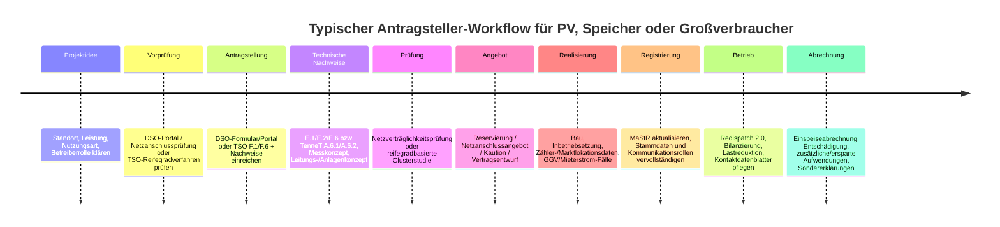

# Katalog öffentlicher XLSX-Downloads für PV, Erzeugungsanlagen, Netzanschluss, Reifegradverfahren und Redispatch in Deutschland

## Kurzfassung

Die Recherche zeigt ein klares Muster: **öffentliche XLSX-Dateien finden sich derzeit vor allem bei den Übertragungsnetzbetreibern für das Reifegradverfahren sowie bei Verteilnetzbetreibern und Verbänden rund um Redispatch 2.0, Bilanzierung und Sonderfälle wie Mieterstrom/GGV**. Für die klassische **PV-/Erzeugungsanlagen-Anmeldung im Massengeschäft** setzen viele Netzbetreiber inzwischen primär auf **Portale** oder **PDF-Formulare**, nicht auf frei verlinkte XLSX-Dateien. Das gilt insbesondere für Bayernwerk, Netze BW, N‑ERGIE und viele steuerliche Prozesse der Länderfinanzverwaltungen. 50Hertz, Amprion und TransnetBW stellen dagegen im Kontext des 2026 gestarteten **Reifegradverfahrens** öffentlich herunterladbare XLSX-Dateien der Formulare **F.1** und **F.6** bereit; TransnetBW bietet darüber hinaus weitere XLSX für Lastreduktionsdaten und Bilanzierungsgebiete. Westnetz und Bayernwerk haben mehrere offen zugängliche XLSX für Redispatch-, Mess-/Marktstammdaten- und Kundenanlagen-Prozesse.

Für **TenneT Germany** konnte ich im offiziellen Umfeld **keine verlässlich verifizierbare öffentliche XLSX-Datei** für F.1/F.6 oder TenneT-spezifische Antragsformulare extrahieren; die gemeinsame 4‑ÜNB‑Verfahrensdokumentation weist aber aus, dass TenneT im Reifegradverfahren statt VDE‑Formblatt **E.1/E.6** die eigenen **A.6.1/A.6.2** aus den TenneT-Netzanschlussregeln verlangt. Gleichzeitig war das TenneT-Webumfeld im Crawl teilweise durch `robots.txt` eingeschränkt. Für Netze BW, N‑ERGIE, SWM sowie die Landesfinanzverwaltungen gilt: **öffentliche XLSX im angefragten Scope waren entweder nicht vorhanden, nicht verifizierbar oder der Prozess läuft heute portalbasiert/PDF-basiert**.

In den Tabellen unten sind **nur Dateien aufgeführt, die als XLSX identifiziert wurden** oder bei denen die öffentliche Seite explizit „XLSX“ nennt. Wo nur ein **XLS** vorlag, ist das ausdrücklich als **Altformat** markiert und **nicht** in den Kernkatalog aufgenommen. HTTP-Metadaten wurden – soweit technisch prüfbar – als direkte Downloadbeobachtungen ergänzt; **Last-Modified** war in dieser Umgebung regelmäßig nicht verfügbar.  

## Priorisierte Suchreihenfolge

| Priorität | Stelle | Warum zuerst suchen | Ergebnisbild |
|---|---|---|---|
| Hoch | 50Hertz, Amprion, TransnetBW | höchste Trefferwahrscheinlichkeit für **F.1/F.6** und weitere strukturierte XLSX im Reifegradverfahren | mehrere bestätigte öffentliche XLSX |
| Hoch | Bayernwerk, Westnetz | viele öffentliche XLSX im Umfeld **Redispatch 2.0**, Kundenanlagen, Marktlokationen, Mess-/Marktkommunikation | mehrere bestätigte öffentliche XLSX |
| Mittel | TenneT Germany | fachlich sehr relevant wegen Reifegradverfahren, aber Crawling eingeschränkt; TenneT-spezifische Unterlagen werden in 4‑ÜNB-Dokumentation erwähnt | öffentliche XLSX im Scope nicht verifiziert; Anforderungen dokumentiert |
| Mittel | netztransparenz.de, BDEW | gemeinsame ÜNB-/Branchenprozesse, Sondererklärungen, Redispatch-Use-Cases | einzelne relevante XLSX öffentlich verfügbar |
| Mittel | MaStR, Bundesnetzagentur | eher Hilfs-/Publikationsdateien als eigentliche Antragsformulare | einzelne XLSX, aber kaum klassische Formulare |
| Niedriger | Netze BW, N‑ERGIE, SWM | Prozesse häufig portal- oder PDF-basiert; im angefragten Scope wenige bis keine öffentlichen XLSX | überwiegend Portale/PDF; fehlende XLSX im Scope |
| Niedriger | Landesämter/Finanzverwaltungen | PV-/Steuerprozesse laufen heute meist über **ELSTER** oder PDF | keine belastbaren öffentlichen PV-spezifischen XLSX im Scope |

## Katalog nach Formtyp

**Hinweis zur Spalte „Lizenz/Nachnutzung“:** Soweit auf den recherchierten Seiten **keine offene Lizenz** ausdrücklich ausgewiesen war, ist **„keine offene Lizenz ersichtlich“** vermerkt. Das ist **keine Rechtsberatung**, sondern eine Dokumentation des öffentlich sichtbaren Zustands.

### Reifegradverfahren F.1–F.6

| Stelle | Formtyp | Datei | XLSX | Zweck | Typische Felder | Direkt-URL | HTTP-Metadaten | PDF-Äquivalent / ergänzende Pflichtunterlagen | Login | Lizenz/Nachnutzung |
|---|---|---|---|---|---|---|---|---|---|---|
| 50Hertz | F.1 | `f.1 reifegradverfahren-antragsformular v1.0.xlsx` | ✅ | Mantelformular für Netzanschlussbegehren im Reifegradverfahren | Anlagenanschrift, Petent, Rechnungsadresse, gewünschter Netzanschlusspunkt, Leistung, Zeitplan, Flächensicherung/Genehmigungsstand | `https://www.50hertz.com/cdn/files/f9f84644-593e-40c0-99bd-08de96054505/f.1%20reifegradverfahren-antragsformular%20v1.0.xlsx` | CT `application/vnd.openxmlformats-officedocument.spreadsheetml.sheet`; CL `143834`; LM n.v. | auf derselben 50Hertz-Seite sind F.2–F.5 als weitere Downloadformulare genannt; für 50Hertz gelten zusätzlich VDE-Formblätter E.1/E.2/E.6 | öffentlich | keine offene Lizenz ersichtlich |
| 50Hertz | F.6 | `f.6 reifegradverfahren-antragsformular für vnb v001.xlsx` | ✅ | Antragsformular für VNB / ad-hoc-Bedarfe | VNB-Firmendaten, Rechnungsdaten, gewünschter NAP, Bezugs-/Einspeiseleistung, Probebetrieb, Inbetriebnahme | `https://www.50hertz.com/cdn/files/bf7c50bc-0ead-4292-99bc-08de96054505/f.6%20reifegradverfahren-antragsformular%20fu%CC%88r%20vnb%20v001.xlsx` | CT XLSX; CL `148722`; LM n.v. | F.2–F.5 auf derselben Seite; 4‑ÜNB-Dokumentation nennt F.6 explizit | öffentlich | keine offene Lizenz ersichtlich |
| Amprion | F.1 | `F.1-Reifegradverfahren-Antragsformular-V1.0.xlsx` | ✅ | Mantelformular für vollständigen Netzanschlussantrag im Reifegradverfahren | wie oben: Projektkerninfos, Adresse, Petent, Rechnungsdaten, NAP, Leistung, Zeitplan, Land-/Genehmigungsnachweise | `https://www.amprion.net/Dokumente/Strommarkt/Netzkunden/Netzanschlussregeln/F.1-Reifegradverfahren-Antragsformular-V1.0.xlsx` | CT XLSX; CL `147771`; LM n.v. | Amprion listet F.2–F.5 sowie Vertraulichkeitserklärung; zusätzlich verweist Amprion auf VDE-Formblätter E.1/E.2/E.6 | öffentlich | keine offene Lizenz ersichtlich |
| Amprion | F.6 | `F.6-Reifegradverfahren-Antragsformular-fuer-VNB-V001.xlsx` | ✅ | Antragsformular für VNB bei ad-hoc-Bedarfen großlastiger Projekte | VNB-Daten, Rechnungsdaten, NAP, Bezugs-/Einspeiseleistung, Meilensteine | `https://www.amprion.net/Dokumente/Strommarkt/Netzkunden/Netzanschlussregeln/F.6-Reifegradverfahren-Antragsformular-fuer-VNB-V001.xlsx` | CT XLSX; CL `153073`; LM n.v. | F.2–F.5 auf derselben Amprion-Seite; weitere Infos auf netztransparenz.de | öffentlich | keine offene Lizenz ersichtlich |
| TransnetBW | F.1 | `F.1 Reifegradverfahren-Antragsformular V1.0.xlsx` | ✅ | Mantelformular im Reifegradverfahren | Projekt-/Petentendaten, Rechnungsinfo, Koordinaten, NAP, Stromkreisverbindung, Leistung, Zeitplan, Nachweise A–D | `https://www.transnetbw.de/_Resources/Persistent/2/6/a/c/26acb20ee28f955506e7ef015f5ec24489c53a0b/F.1%20Reifegradverfahren-Antragsformular%20V1.0.xlsx` | CT XLSX; CL `147164`; LM n.v. | TransnetBW nennt auf der Seite F.2–F.5 sowie Bankbestätigung; für TransnetBW gelten zusätzlich VDE-Formblätter E.1/E.2/E.6 | öffentlich | keine offene Lizenz ersichtlich |
| TransnetBW | F.6 | `F.6 Reifegradverfahren-Antragsformular für VNB V001.xlsx` | ✅ | Antragsformular für VNB (ad-hoc-Bedarfe) | VNB-Daten, Rechnungsadresse, NAP, Bezugs-/Einspeiseleistung, Zeitplan | `https://www.transnetbw.de/_Resources/Persistent/f/d/7/3/fd734b26f1788063cbe25cd9fa2a0bdc45760140/F.6%20Reifegradverfahren-Antragsformular%20fu%CC%88r%20VNB%20V001.xlsx` | CT XLSX; CL `158382`; LM n.v. | F.2–F.5 + Bankbestätigung auf derselben Seite | öffentlich | keine offene Lizenz ersichtlich |
| TenneT Germany | F.1/F.6 bzw. TenneT-spezifisch A.6.1/A.6.2 | **keine öffentliche XLSX im Crawl verifiziert** | ❌ | 4‑ÜNB-Dokumentation weist TenneT-spezifische A.6.1/A.6.2 aus | — | — | — | TenneT verlangt laut 4‑ÜNB-Dokumentation A.6.1/A.6.2 aus Anhang‑A der TenneT-Netzanschlussregeln; öffentliche XLSX-URL im Crawl nicht extrahierbar | teils crawl-beschränkt | — |

### Anmeldung, Kundenanlage, GGV, Marktlokation

| Stelle | Formtyp | Datei | XLSX | Zweck | Typische Felder | Direkt-URL | HTTP-Metadaten | PDF-Äquivalent / Hinweis | Login | Lizenz/Nachnutzung |
|---|---|---|---|---|---|---|---|---|---|---|
| Westnetz | Anmeldung / Kundenanlage | `anmeldung-marktlokation-kundenanlage.xlsx` | ✅ | Anmeldung/Abmeldung einer Marktlokation in einer Kundenanlage, u. a. für Mieterstrom-/Kundenanlagenfälle | Kundenanlagenbetreiber, Anlagenadresse, Identifikator, Letztverbraucher, Lagezusatz, Zählernummer | `https://www.westnetz.de/content/dam/revu-global/westnetz/documents/einspeisen/aktuelles-fuer-einspeisende/anmeldung-marktlokation-kundenanlage.xlsx` | CT XLSX; CL `17547`; LM n.v. | auf der Westnetz-Infoseite ausdrücklich als XLSX genannt; PDF-Äquivalent im Crawl nicht gefunden | öffentlich | keine offene Lizenz ersichtlich |
| Bayernwerk | GGV / Marktlokationen | `aufteilungsschluessel_meldung-malos.xlsx` | ✅ | Meldung der teilnehmenden Marktlokationen für **gemeinschaftliche Gebäudeversorgung** | Straße/Hausnummer, PLZ/Ort, HarNES-ID, Malo, Zählernummer, Aufteilung/Quote | `https://www.bayernwerk-netz.de/content/dam/revu-global/bayernwerk-netz/files/energie-anschliessen/aufteilungsschluessel_meldung-malos.xlsx` | CT XLSX; CL `18648`; LM n.v. | Datei selbst fordert Versand **zusammen mit dem Meldeformular**; die Seite nennt „Excel: Meldung der teilnehmenden Marktlokationen“ | öffentlich | keine offene Lizenz ersichtlich |

### Einspeiseabrechnung, Bank-/Steuer-/Marktstammdaten, Mess-/Bilanzierung

| Stelle | Formtyp | Datei | XLSX | Zweck | Typische Felder | Direkt-URL | HTTP-Metadaten | PDF-Äquivalent / Hinweis | Login | Lizenz/Nachnutzung |
|---|---|---|---|---|---|---|---|---|---|---|
| Westnetz | Mess-/Marktstammdaten | `esa-kontaktdatenblatt.xlsx` | ✅ | Kontaktdatenblatt Netzbetreiber / Marktkommunikation | Name, Anschrift, Rollen, GLN/BDEW-Codes, Bilanzierungsgebiet, E‑Mail für EDIFACT, Fachkontakte | `https://www.westnetz.de/content/dam/revu-global/westnetz/documents/fuer-partnerfirmen/zaehlerwesen-messstellenbetrieb/esa-kontaktdatenblatt.xlsx` | CT XLSX; CL `37141`; LM n.v. | kein PDF-Äquivalent beobachtet | öffentlich | keine offene Lizenz ersichtlich |
| TransnetBW | Bilanzierung / Stammdaten | `VNB-Bilanzierungsgebiete` | ✅ | aktuelle Bilanzierungsgebiete in der Regelzone TransnetBW | Regelzonen‑EIC, Stromnetzbetreiber, GLN, BDEW-Code, Bilanzierungsgebiet, Gültigkeit | `https://webservices.transnetbw.de/files/?extension=xlsx&redirect=1&structure=latest&type=balancingAreas` | CT XLSX; CL `28407`; LM n.v. | CSV-Äquivalent wird auf derselben Seite parallel angeboten | öffentlich | keine offene Lizenz ersichtlich |
| netztransparenz | EEG-/Einspeiseabrechnung / Sondererklärung | `formular_gemeinsame_erklärung_nach_p23b_abs_3_eeg2021.xlsx` | ✅ | gemeinsame Erklärung für den Aufschlag 2021 für ausgeförderte Windenergieanlagen | Kontaktperson, erklärende Gesellschaft, Register-/USt-ID, WZ-Code, MaStR-Nummern, Anschlussnetzbetreiber, Höchstbetrag | `https://www.netztransparenz.de/xspproxy/api/staticfiles/ntp-relaunch/dokumente/erneuerbare%20energien%20und%20umlagen/eeg/eeg-abrechnungen/ausgef%C3%B6rderte%20anlagen/aufschlag-2021-f%C3%BCr-windenergieanlagen/formular_gemeinsame_erkl%C3%A4rung_nach_p23b_abs_3_eeg2021.xlsx` | CT XLSX; CL `718700`; LM n.v. | Seite nennt das XLSX ausdrücklich als verbindliche elektronische Formularvorlage | öffentlich | keine offene Lizenz ersichtlich |
| MaStR | Hilfsdatei / Registerhilfe, **kein Antragsformular** | `Label_und_Hilfetexte_fuer_die_Veroeffentlichung_fuer_Anpassungen_nach_dem_15.02.2025.xlsx` | ✅ | Hilfetexte/Labels zur Veröffentlichung im Marktstammdatenregister | keine eigentliche Eingabemaske; Hilfetexte, Feldbezeichnungen, Veröffentlichungslogik | `https://www.marktstammdatenregister.de/mastrhilfe/files/regHilfen/Label_und_Hilfetexte_fuer_die_Veroeffentlichung_fuer_Anpassungen_nach_dem_15.02.2025.xlsx` | HTTP-Metadaten im direkten Test nicht verifizierbar | **kein Formular**, sondern Hilfsdatei; Registrierung selbst portalbasiert | Hilfe öffentlich, eigentliche Registrierung portalbasiert | keine offene Lizenz ersichtlich |

### Redispatch, Abregelung, Entschädigung, Abrechnung

| Stelle | Formtyp | Datei | XLSX | Zweck | Typische Felder | Direkt-URL | HTTP-Metadaten | PDF-Äquivalent / Hinweis | Login | Lizenz/Nachnutzung |
|---|---|---|---|---|---|---|---|---|---|---|
| TransnetBW | Lastreduktion / Redispatch-nah | `SVE_Muster_Bewegungsdatenabfrage.xlsx` | ✅ | Datenmeldung zur geplanten Lastaufnahme / Lastreduktionspotenzial industrieller Großverbraucher | Unternehmen, Anlagenname, Business-Tag, Spannungsebene, NAP/NVP, Höchstlast, Vorlaufzeiten, 15‑Minuten‑Zeitreihen | `https://www.transnetbw.de/_Resources/Persistent/6/e/1/5/6e1563ba2034f2bd743ef6d67175229d769e4d47/SVE_Muster_Bewegungsdatenabfrage.xlsx` | CT XLSX; CL `32325`; LM n.v. | auf der Seite als einziges Downloadmuster ausgewiesen | öffentlich | keine offene Lizenz ersichtlich |
| Bayernwerk | Redispatch / technischer Nachweis | `protokoll-redispatch-bei-pave-ueberwachung.xlsx` | ✅ | Prüf-/Redispatchkonzept für Erzeugungsanlagen und Speicher mit PAV,E-Überwachung und mehreren steuerbaren Ressourcen | Anlagenname, NAP, vertragliche Einspeiseleistung PAV,E, Mischanlage ja/nein, installierte Leistungen je SR, Messwerte vor/nach Redispatch | `https://www.bayernwerk-netz.de/content/dam/revu-global/bayernwerk-netz/files/netz/netzanschluss/Strom/technische_Mindestanforderungen_ab01112018/Hochspannung/protokoll-redispatch-bei-pave-ueberwachung.xlsx` | CT XLSX; CL `52127`; LM n.v. | im Crawl kein PDF-Äquivalent identifiziert | öffentlich | keine offene Lizenz ersichtlich |
| Bayernwerk | Redispatch / Marktakteure | `Kontaktdatenblatt_Redispatch.xlsx` | ✅ | Kontaktdatenblatt Marktakteure Redispatch 2.0 | Anschrift, Rollen EIV/BTR, GLN/BDEW-Codes, Kommunikationsadresse | `https://www.bayernwerk-netz.de/content/dam/revu-global/bayernwerk-netz/files/energieservice/messstellenbetrieb/Kontaktdatenblatt_Redispatch.xlsx` | CT XLSX; CL `20886`; LM n.v. | kein PDF-Äquivalent beobachtet | öffentlich | keine offene Lizenz ersichtlich |
| Bayernwerk | Redispatch / Abrechnung | `vorlage_zusaetzliche-ersparte_aufwendungenABE.xlsx` | ✅ | Vorlage für zusätzliche/ersparte Aufwendungen im finanziellen Ausgleich | Maßnahmen-ID, EEG-Einzelanlagenschlüssel, TR-ID, zusätzliche Aufwendungen, ersparte Aufwendungen | `https://www.bayernwerk-netz.de/content/dam/revu-global/bayernwerk-netz/files/Energieeinspeisen/redispatch/finanzieller-ausgleich/vorlage_zusaetzliche-ersparte_aufwendungenABE.xlsx` | CT XLSX; CL `48766`; LM n.v. | im Crawl kein PDF-Äquivalent identifiziert | öffentlich | keine offene Lizenz ersichtlich |
| Bayernwerk | Redispatch / Reklamation Abrechnung | `mustertabelle-nicht-abgerechnete-fehlende-redispatchmaßnahmen.xlsx` | ✅ | Liste mutmaßlich fehlender/nicht abgerechneter Maßnahmen | Beginn/Ende der Maßnahme, Datum/Uhrzeit, optionale Schätzung Ausfallarbeit, Anmerkungen | `https://www.bayernwerk-netz.de/content/dam/revu-global/bayernwerk-netz/files/Energieeinspeisen/redispatch/redispatch-kontaktformular/formular-1/mustertabelle-nicht-abgerechnete-fehlende-redispatchma%C3%9Fnahmen.xlsx` | CT XLSX; CL `13591`; LM n.v. | im Crawl kein PDF-Äquivalent identifiziert | öffentlich | keine offene Lizenz ersichtlich |
| Westnetz | Redispatch / Marktakteure | `kontaktdatenblatt-redispatch.xlsx` | ✅ | Kontaktdatenblatt Marktakteure Redispatch 2.0 | Anschrift, Rollen EIV/BTR, GLN/BDEW, Kommunikationsadresse | `https://www.westnetz.de/content/dam/revu-global/westnetz/documents/fuer-partnerfirmen/redispatch20/kontaktdatenblatt-redispatch.xlsx` | CT XLSX; CL `20990`; LM n.v. | kein PDF-Äquivalent beobachtet | öffentlich | keine offene Lizenz ersichtlich |
| BDEW | Redispatch / Umsetzungshilfe, **kein Antragsformular** | `Kopie_von_2021-05-21_RD2.0_Use_Cases_-_Umsetzungshilfe.xlsx` | ✅ | Use-Case-/Anwendungshilfe zu Redispatch 2.0 | Kategorien, Kapitel, Use-Case-Nummern, Titel, Abkürzungen | `https://www.bdew.de/media/documents/Kopie_von_2021-05-21_RD2.0_Use_Cases_-_Umsetzungshilfe.xlsx` | CT XLSX; CL `44858`; LM n.v. | keine Eingabedatei, sondern Prozess-/Mappingshilfe | öffentlich | keine offene Lizenz ersichtlich |

### E.1–E.11, Inbetriebsetzung, klassische PV-Anmeldung

Für die **klassischen VDE-Formblätter E.1–E.11** konnte ich **öffentlich verifizierbare XLSX-Downloads** auf den offiziellen Betreiberseiten **nicht belastbar nachweisen**. Was sich belastbar nachweisen lässt, ist der **offizielle Verweis** von Amprion und TransnetBW auf die **VDE-Formblätter E.1, E.2 und E.6** als zusätzlich erforderliche Unterlagen im Reifegradverfahren; im TenneT-Fall verweist die 4‑ÜNB-Dokumentation auf **A.6.1/A.6.2** aus den TenneT-Netzanschlussregeln. Für die breite DSO-PV-Anmeldung werden heute häufig **Portale** oder **PDF-Assets** genutzt.

Für **Netze BW** erschien im Crawl ein „Anfrageformular PV“ als Asset, aber **nicht verifizierbar als XLSX**; gleichzeitig verweist Netze BW auf Service-/Portalprozesse für Stromeinspeisung und Kundenportal. Für **Bayernwerk** ist der Standardprozess ebenfalls portalgestützt. Für **N‑ERGIE** und **SWM** konnten im angefragten Scope keine öffentlichen XLSX zur klassischen Erzeugungsanlagenanmeldung verifiziert werden; die Seiten verweisen auf Formulare, Kontakt und Online‑Services.

## Mini-Ansichten der offiziellen Downloadseiten

**50Hertz – Reifegradverfahren**

> „Die für einen Antrag nach dem Reifegradverfahren benötigten Formulare finden Sie hier zum Download. F.1 … F.6 …“

**TransnetBW – Bilanzierungsgebiete / Redispatch-nahe Downloads**

> „VNB‑Bilanzierungsgebiete, xlsx“ und „Formular Anmeldung RD 2.0“ im Downloadbereich.

> „Muster Bewegungsdatenabfrage – XLSX 32kb“.

**netztransparenz – Sondererklärung Wind 2021**

> „Hier finden Sie das Antragsformular … Formular_Gemeinsame_Erklärung_nach_P23b_Abs_3_EEG2021, XLSX, 701.86 KB“.

**Westnetz – Kundenanlage / Marktlokation**

> „Anmeldung zur Erstellung einer Marktlokation in einer Kundenanlage (XLSX)“.

## CSV-Auszug

Der folgende Auszug kann direkt als `xlsx_katalog_excerpt.csv` gespeichert werden.

```csv
entity,formtyp,filename,xlsx,url,login,content_type,content_length,last_modified,purpose,pdf_equivalent_or_note
50Hertz,F.1 Reifegradverfahren,"f.1 reifegradverfahren-antragsformular v1.0.xlsx",yes,"https://www.50hertz.com/cdn/files/f9f84644-593e-40c0-99bd-08de96054505/f.1%20reifegradverfahren-antragsformular%20v1.0.xlsx",public,"application/vnd.openxmlformats-officedocument.spreadsheetml.sheet",143834,n.v.,"Mantelformular für Netzanschlussbegehren im Reifegradverfahren","F.2-F.5 auf derselben Seite; zusätzlich E.1/E.2/E.6"
50Hertz,F.6 Reifegradverfahren,"f.6 reifegradverfahren-antragsformular für vnb v001.xlsx",yes,"https://www.50hertz.com/cdn/files/bf7c50bc-0ead-4292-99bc-08de96054505/f.6%20reifegradverfahren-antragsformular%20fu%CC%88r%20vnb%20v001.xlsx",public,"application/vnd.openxmlformats-officedocument.spreadsheetml.sheet",148722,n.v.,"VNB-Antragsformular im Reifegradverfahren","F.2-F.5 auf derselben Seite"
Amprion,F.1 Reifegradverfahren,"F.1-Reifegradverfahren-Antragsformular-V1.0.xlsx",yes,"https://www.amprion.net/Dokumente/Strommarkt/Netzkunden/Netzanschlussregeln/F.1-Reifegradverfahren-Antragsformular-V1.0.xlsx",public,"application/vnd.openxmlformats-officedocument.spreadsheetml.sheet",147771,n.v.,"Mantelformular für vollständigen Netzanschlussantrag","F.2-F.5 + Vertraulichkeitserklärung; zusätzlich E.1/E.2/E.6"
Amprion,F.6 Reifegradverfahren,"F.6-Reifegradverfahren-Antragsformular-fuer-VNB-V001.xlsx",yes,"https://www.amprion.net/Dokumente/Strommarkt/Netzkunden/Netzanschlussregeln/F.6-Reifegradverfahren-Antragsformular-fuer-VNB-V001.xlsx",public,"application/vnd.openxmlformats-officedocument.spreadsheetml.sheet",153073,n.v.,"VNB-Antragsformular für ad-hoc-Bedarfe","F.2-F.5 auf derselben Seite"
TransnetBW,F.1 Reifegradverfahren,"F.1 Reifegradverfahren-Antragsformular V1.0.xlsx",yes,"https://www.transnetbw.de/_Resources/Persistent/2/6/a/c/26acb20ee28f955506e7ef015f5ec24489c53a0b/F.1%20Reifegradverfahren-Antragsformular%20V1.0.xlsx",public,"application/vnd.openxmlformats-officedocument.spreadsheetml.sheet",147164,n.v.,"Mantelformular für Reifegradverfahren","F.2-F.5 + Bankbestätigung; zusätzlich E.1/E.2/E.6"
TransnetBW,F.6 Reifegradverfahren,"F.6 Reifegradverfahren-Antragsformular für VNB V001.xlsx",yes,"https://www.transnetbw.de/_Resources/Persistent/f/d/7/3/fd734b26f1788063cbe25cd9fa2a0bdc45760140/F.6%20Reifegradverfahren-Antragsformular%20fu%CC%88r%20VNB%20V001.xlsx",public,"application/vnd.openxmlformats-officedocument.spreadsheetml.sheet",158382,n.v.,"VNB-Antragsformular im Reifegradverfahren","F.2-F.5 + Bankbestätigung"
TransnetBW,Lastreduktion,"SVE_Muster_Bewegungsdatenabfrage.xlsx",yes,"https://www.transnetbw.de/_Resources/Persistent/6/e/1/5/6e1563ba2034f2bd743ef6d67175229d769e4d47/SVE_Muster_Bewegungsdatenabfrage.xlsx",public,"application/vnd.openxmlformats-officedocument.spreadsheetml.sheet",32325,n.v.,"Meldung Lastaufnahme/Lastreduktionspotenzial","kein PDF-Äquivalent beobachtet"
Bayernwerk,Redispatch,"protokoll-redispatch-bei-pave-ueberwachung.xlsx",yes,"https://www.bayernwerk-netz.de/content/dam/revu-global/bayernwerk-netz/files/netz/netzanschluss/Strom/technische_Mindestanforderungen_ab01112018/Hochspannung/protokoll-redispatch-bei-pave-ueberwachung.xlsx",public,"application/vnd.openxmlformats-officedocument.spreadsheetml.sheet",52127,n.v.,"Prüf-/Redispatchkonzept mit PAV,E-Überwachung","kein PDF-Äquivalent beobachtet"
Bayernwerk,GGV/Marktlokation,"aufteilungsschluessel_meldung-malos.xlsx",yes,"https://www.bayernwerk-netz.de/content/dam/revu-global/bayernwerk-netz/files/energie-anschliessen/aufteilungsschluessel_meldung-malos.xlsx",public,"application/vnd.openxmlformats-officedocument.spreadsheetml.sheet",18648,n.v.,"Meldung teilnehmender Malos für gemeinschaftliche Gebäudeversorgung","zusammen mit Meldeformular einsenden"
Westnetz,Kundenanlage/Marktlokation,"anmeldung-marktlokation-kundenanlage.xlsx",yes,"https://www.westnetz.de/content/dam/revu-global/westnetz/documents/einspeisen/aktuelles-fuer-einspeisende/anmeldung-marktlokation-kundenanlage.xlsx",public,"application/vnd.openxmlformats-officedocument.spreadsheetml.sheet",17547,n.v.,"An-/Abmeldung Marktlokation in Kundenanlage","kein PDF-Äquivalent gefunden"
netztransparenz,EEG-Sondererklärung,"formular_gemeinsame_erklärung_nach_p23b_abs_3_eeg2021.xlsx",yes,"https://www.netztransparenz.de/xspproxy/api/staticfiles/ntp-relaunch/dokumente/erneuerbare%20energien%20und%20umlagen/eeg/eeg-abrechnungen/ausgef%C3%B6rderte%20anlagen/aufschlag-2021-f%C3%BCr-windenergieanlagen/formular_gemeinsame_erkl%C3%A4rung_nach_p23b_abs_3_eeg2021.xlsx",public,"application/vnd.openxmlformats-officedocument.spreadsheetml.sheet",718700,n.v.,"Verbindliche elektronische Erklärung nach §23b Abs. 3 EEG 2021","autoritative XLSX-Vorlage"
```

Die Zeilen im CSV-Auszug entsprechen den offiziellen Fundstellen in den Tabellen und Abschnitten oben.

## Fehlende oder nicht öffentlich verifizierbare XLSX und sinnvolle Kontaktpunkte

**TenneT Germany.** Fachlich hochrelevant, aber im Crawl waren die relevanten TenneT-Seiten nur eingeschränkt zugänglich. Die gemeinsame 4‑ÜNB‑Dokumentation zeigt zwar, dass TenneT im Reifegradverfahren eigene Formblätter **A.6.1/A.6.2** verlangt, eine verifizierte öffentliche XLSX-URL dafür konnte ich nicht extrahieren. Sinnvoller Eskalationsweg: Kontakt über TenneT-Webauftritt bzw. die im Impressum sichtbare Adresse `onlineredaktion@tennet.eu`; für formelle Fachanfragen sollte zusätzlich die Netzanschluss-/Kundenbetreuung auf tennet.eu genutzt werden.

**Netze BW.** Die öffentlichen Seiten zur Stromeinspeisung, Abrechnung und Hilfecenter-Struktur sind klar sichtbar; öffentliche XLSX für die eigentliche PV-/Erzeugungsanlagen-Anmeldung konnte ich im angefragten Scope aber nicht belastbar verifizieren. Kontaktpunkt: **einspeiser@netze-bw.de** bzw. Kundenservice Stromeinspeisung; viele Abläufe laufen über Kundenportal/Serviceprozesse.

**N‑ERGIE Netz.** Es gibt öffentliche Formular-/FAQ-Seiten und Online‑Services für Erzeugungsanlagen, aber im recherchierten Scope keine verifizierten öffentlichen XLSX für PV-/Erzeugungsanlagen-Anmeldung, Redispatch oder GGV. Kontaktpunkte: **Einspeisehotline 0800 271‑1020**, Online‑Service Erzeugungsanlagen, Kontaktformular/Telefonkontakt.

**SWM Infrastruktur.** Für Netzanschluss/Erzeugungsanlagen sind Kontakt- und Servicewege klar öffentlich; im angefragten Scope konnte ich aber keine belastbaren öffentlichen XLSX für PV-/Erzeugungsanlagen/Redispatch nachweisen. Kontaktpunkte: **netzanschluss@swm-infrastruktur.de** und die technischen Stromkontakte auf der Kontaktseite; zusätzlich ist die Themenkachel „Erzeugungsanlagen“ auf der Startseite vorhanden.

**Landesfinanzverwaltungen.** Für PV-/Steuerfragen verweisen NRW, Bayern und Baden‑Württemberg primär auf **ELSTER** bzw. **PDF-Vordrucke**. Öffentliche PV-spezifische XLSX-Formulare konnte ich nicht verifizieren. Das ist wichtig, wenn ein Antragsteller „Steuer-/Bankdaten-Änderung per Excel“ erwartet: In der Praxis ist das häufig **nicht** der offizielle Weg.

**Bayernwerk-Altformat.** Bayernwerk hat für Wetterdaten einen öffentlichen **Excel-Download im Altformat `.xls`**, nicht `.xlsx`. Das ist für einen XLSX-Katalog relevant, gehört aber **nicht** in den Kernbestand. Versand laut Seite an `wetterdaten@bayernwerk.com`.

## Workflow

Die folgende Zeitleiste verdichtet den öffentlich dokumentierten Prozess aus Bayernwerk‑Portalprozessen, TransnetBW-/Amprion‑Downloadseiten und der 4‑ÜNB‑Verfahrensdokumentation: Erst Information/Vorprüfung, dann Antrag mit Formularen und Nachweisen, danach Netzprüfung bzw. Clusterstudie, anschließend Vertrags-/Inbetriebnahmephase, Registrierung im MaStR, laufender Redispatch-/Abrechnungsbetrieb und ggf. spätere Datenänderungen.



## Offene Fragen und Grenzen

Nicht alle gewünschten Punkte ließen sich mit gleicher Sicherheit verifizieren. Die größten Lücken betreffen **TenneT Germany** sowie die **klassischen E.1–E.11‑Formblätter als XLSX**. In den offiziellen Seiten ließ sich zwar der Bedarf bzw. Verweis auf diese Unterlagen nachweisen, aber **nicht** durchgehend eine frei zugängliche offizielle XLSX-URL. Für **Netze BW, N‑ERGIE, SWM** und die **Landesfinanzverwaltungen** ist die belastbare Aussage daher: **im untersuchten Scope keine oder keine sicher verifizierbaren öffentlichen XLSX**, weil die Prozesse überwiegend über Portale bzw. PDF laufen.

Eine zweite Grenze betrifft die **grafischen Screenshots der Downloadseiten**: In dieser Recherche konnte ich die Downloadseiten zuverlässig als **zitierfähige Textausschnitte**, nicht aber als echte Browser-Screenshots rendern. Deshalb sind oben **offizielle Listing-Ausschnitte** als „Mini-Ansichten“ dokumentiert. Inhaltlich sind die Fundstellen belastbar; die Darstellung ist textbasiert.

## Quellen aus PDF-Verweisen

Die folgenden URLs stammen aus den im PDF-Export enthaltenen Fußnoten und ergänzen die Direktlinks in den Tabellen.

| Bezug | URL |
|---|---|
| 50Hertz Netzanschluss | <https://www.50hertz.com/de/Vertragspartner/Netzkunden/Netzanschluss> |
| 4-ÜNB Reifegradverfahren Verfahrensdokumentation | <https://www.netztransparenz.de/Portals/1/Dokumente/Reifegradverfahren/Vier%20U%CC%88NB%20-%20Reifegradverfahren%20-%20Verfahrensdokumentation%20V1.1.pdf> |
| Bayernwerk Redispatch PAV,E-Ueberwachung | <https://www.bayernwerk-netz.de/content/dam/revu-global/bayernwerk-netz/files/netz/netzanschluss/Strom/technische_Mindestanforderungen_ab01112018/Hochspannung/protokoll-redispatch-bei-pave-ueberwachung.xlsx> |
| netztransparenz Aufschlag 2021 Windenergieanlagen | <https://www.netztransparenz.de/de-de/Erneuerbare-Energien-und-Umlagen/EEG/EEG-Abrechnungen/Ausgef%C3%B6rderte-Anlagen/Aufschlag-2021-f%C3%BCr-Windenergieanlagen> |
| MaStR Label und Hilfetexte | <https://www.marktstammdatenregister.de/mastrhilfe/files/regHilfen/Label_und_Hilfetexte_fuer_die_Veroeffentlichung_fuer_Anpassungen_nach_dem_15.02.2025.xlsx> |
| Netze BW Mieterstrom / GGV | <https://www.netze-bw.de/stromeinspeisung/mieterstrom-ggv> |
| Finanzverwaltung NRW Formulare und Ausfuellhilfen | <https://www.finanzverwaltung.nrw.de/grundsteuererklaerung-formulare-und-ausfuehrliche-ausfuellhilfen> |
| 50Hertz F.1 XLSX | <https://www.50hertz.com/cdn/files/f9f84644-593e-40c0-99bd-08de96054505/f.1%20reifegradverfahren-antragsformular%20v1.0.xlsx> |
| 50Hertz F.6 XLSX | <https://www.50hertz.com/cdn/files/bf7c50bc-0ead-4292-99bc-08de96054505/f.6%20reifegradverfahren-antragsformular%20fu%CC%88r%20vnb%20v001.xlsx> |
| Amprion Speicheranlagen | <https://www.amprion.net/Strommarkt/Netzkunden/Netzanschluss/Speicheranlagen.html> |
| Amprion Verteilnetzbetreiber | <https://www.amprion.net/Strommarkt/Netzkunden/Netzanschluss/Verteilnetzbetreiber.html> |
| TransnetBW Reifegradverfahren | <https://www.transnetbw.de/de/transparenz/netzzugang-und-entgelt/reifegradverfahren> |
| Westnetz Aktuelles fuer Einspeisende | <https://www.westnetz.de/de/einspeisen/aktuelles-fuer-einspeisende.html> |
| Bayernwerk gemeinschaftliche Gebaeudeversorgung | <https://www.bayernwerk-netz.de/de/energie-anschliessen/stromnetz/kundenanlagen/gemeinschaftliche-gebaeudeversorgung.html> |
| Westnetz ESA-Kontaktdatenblatt | <https://www.westnetz.de/content/dam/revu-global/westnetz/documents/fuer-partnerfirmen/zaehlerwesen-messstellenbetrieb/esa-kontaktdatenblatt.xlsx> |
| TransnetBW Bilanzierungsgebiete | <https://www.transnetbw.de/de/strommarkt/bilanzierung-und-abrechnung/bilanzierungsgebiete> |
| TransnetBW freiwillige Lastreduktion | <https://www.transnetbw.de/de/transparenz/stoerungen-und-unterbrechungen/freiwillige-lastreduktion> |
| Bayernwerk Kontaktdatenblatt Redispatch | <https://www.bayernwerk-netz.de/content/dam/revu-global/bayernwerk-netz/files/energieservice/messstellenbetrieb/Kontaktdatenblatt_Redispatch.xlsx> |
| Bayernwerk zusaetzliche / ersparte Aufwendungen | <https://www.bayernwerk-netz.de/content/dam/revu-global/bayernwerk-netz/files/Energieeinspeisen/redispatch/finanzieller-ausgleich/vorlage_zusaetzliche-ersparte_aufwendungenABE.xlsx> |
| Bayernwerk fehlende Redispatchmassnahmen | <https://www.bayernwerk-netz.de/content/dam/revu-global/bayernwerk-netz/files/Energieeinspeisen/redispatch/redispatch-kontaktformular/formular-1/mustertabelle-nicht-abgerechnete-fehlende-redispatchma%C3%9Fnahmen.xlsx> |
| Westnetz Kontaktdatenblatt Redispatch | <https://www.westnetz.de/content/dam/revu-global/westnetz/documents/fuer-partnerfirmen/redispatch20/kontaktdatenblatt-redispatch.xlsx> |
| BDEW Redispatch 2.0 Umsetzungshilfe | <https://www.bdew.de/media/documents/Kopie_von_2021-05-21_RD2.0_Use_Cases_-_Umsetzungshilfe.xlsx> |
| Netze BW Asset-Service | <https://api.netze-bw.de/ctfservice/v1/assets/7pSO5xJRLOKSWyquaEQwCm?download=1> |
| Netze BW Abrechnung | <https://www.netze-bw.de/stromeinspeisung/abrechnung> |
| N-ERGIE Erzeugungsanlagen-Formulare | <https://www.n-ergie-netz.de/startseite/erzeugungsanlagen/formulare> |
| SWM Kontakt | <https://www.swm-infrastruktur.de/kontakt> |
| Bayernwerk Wetterdaten | <https://www.bayernwerk-netz.de/de/service/einspeisermanagement/wetterdaten.html> |
| Bayernwerk Ihre Anlage | <https://www.bayernwerk-netz.de/de/energie-einspeisen/ihre-anlage.html> |
